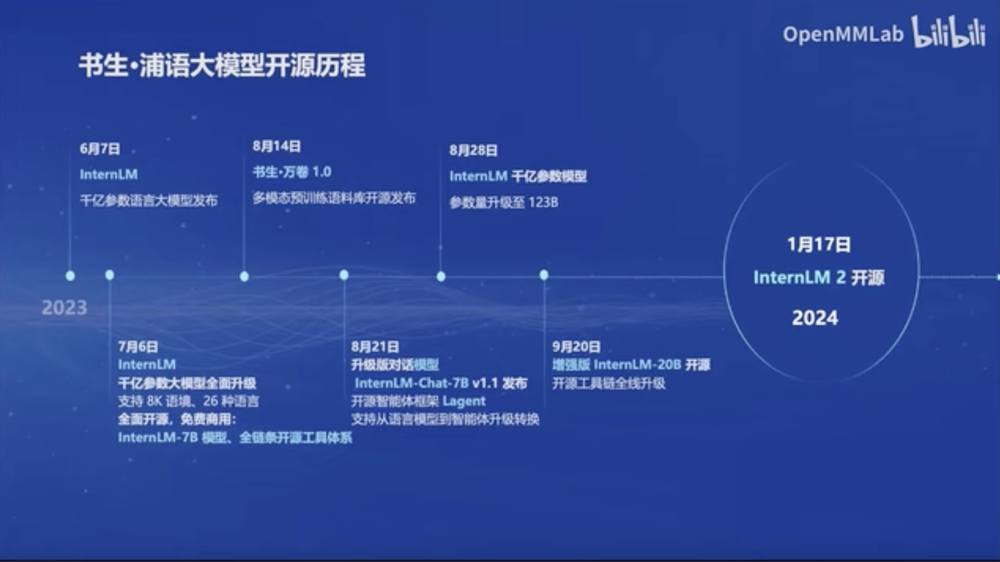
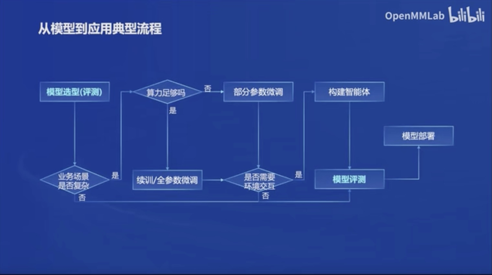
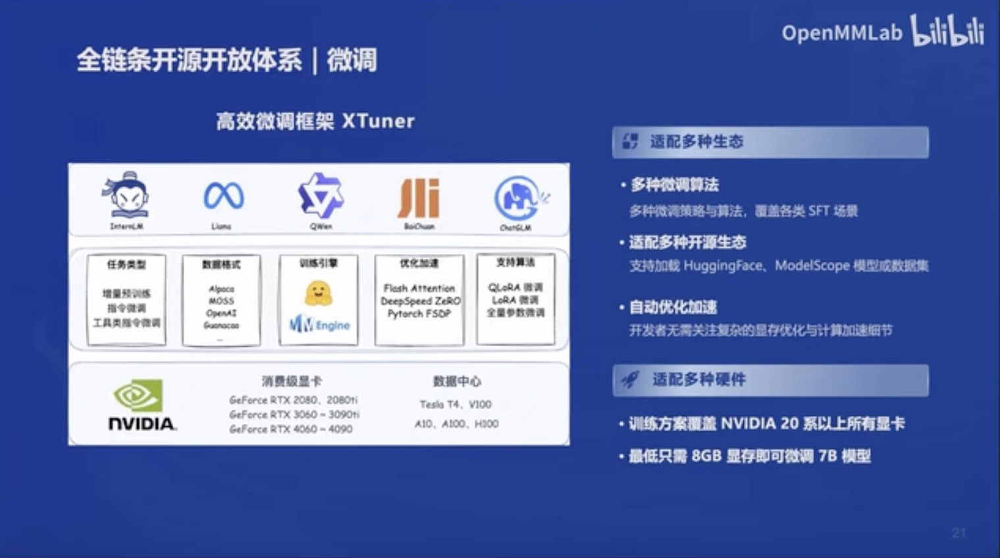
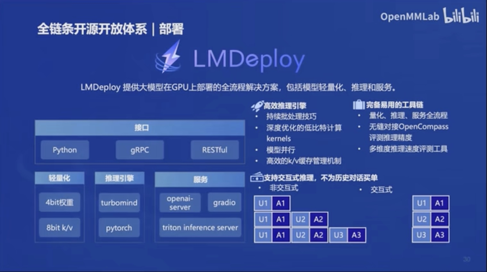

# 书生·浦语大模型全链路开源体系

## 介绍
书生·浦语（InternLM）是由上海人工智能实验室与商汤科技联合香港中文大学、复旦大学发布的新一代大语言模型，InternLM 是在过万亿 token 数据上训练的多语千亿参数基座模型。通过多阶段的渐进式训练，InternLM 基座模型具有较高的知识水平，在中英文阅读理解、推理任务等需要较强思维能力的场景下性能优秀，在多种面向人类设计的综合性考试中表现突出。在此基础上，通过高质量的人类标注对话数据结合 RLHF 等技术，使得 InternLM 可以在与人类对话时响应复杂指令，并且表现出符合人类道德与价值观的回复。

## 开源历程
> 2024年1月17日开源InternLM 2

## InternLM2 版本体系
> 7B版本为轻量级研究，20B综合性能更为强劲

| 模型             | 7B                              | 20B        |
|----------------|---------------------------------|------------|
| InternLM2-Base | 模型基座                            | 模型基座        |
| InternLM2      | 强化版模型基座                         |  强化版模型基座   |
| InternLM2-Chat | 基于Base经过SFT和RLHF，具有共情聊天和调用工具等能力 | 基于Base经过SFT和RLHF，具有共情聊天和调用工具等能力 |

##  语言建模重点
- 数据评估
- 高质量预料
- 补充预料，即模型训练数据中缺少的领域知识

## 亮点
1. 超长上下文 支持20万token上下文
2. 综合性能提示，推理、数学、代码提升
3. 优秀的对话和创作体验
4. 工具调用能力整体升级
5. 突出的数理能力和使用数据分析功能

## 模型能力
1. AI助手
2. 创作
3. 工具调用能力升级
4. 计算能力：高准确率、复杂运算和求解
5. 代码解释器
6. 数据分析，如根据表格生成图表

## 从模型到应用的典型流程

## 全链条开源开放体系
| 工具体系 | 模型               | 能力                                    |
|------|------------------|---------------------------------------|
| 数据   | 书生万卷             | 2TB数据，[数据集](https://opendatalab.com/) |
| 预训练  | InternLM-Train   | 并行训练                                  |
| 微调   | XTuner           | 支持全参数微调，支持LoRA等低成本微调                  |
| 部署   | LMDeploy         | 全链路部署，每秒生成2000+tokens                 |
| 评测   | OpenCompass      | 基于Base经过SFT和RLHF，具有共情聊天和调用工具等能力       |
| 应用   | Lagent AgentLego | 支持多种智能体、代码解释器等多种工具                    |

### 数据
- [数据集](https://opendatalab.com/)

### 预训练 `InternLM-Train`
- 高可扩展：支持从8卡到千卡训练，千卡加速效率达92%
- 极致性能优化
- 兼容主流：无缝接入HuggingFace等技术生态
- 开箱即用：支持多种语言模型，修改配置即可训练

### 微调 `XTuner`

- 增量续训 
  - 使用场景：让基座模型学习新知识，如某个垂直领域只是
  - 训练数据：文章、书籍、代码
- 有监督微调 （全参微调、部分参数微调）
  - 使用场景：让模型学会理解各种指令进行对话
  - 训练数据：高质量对话、问答数据
- 适配多种生态
  - 多种微调算法
  - 适配多开源生态：如HuggingFace、ModelScope模型或数据集
  - 自动优化加速
- 适配多种硬件
  - 覆盖NVIDIA 20系以上所有显卡
  - 最低只需8GB显存即可微调7B模型
  
### 部署 `LMDeploy`
> LMDeploy提供大模型在GPU上部署的全流程解决方案，包括模型轻量化、推理和服务。 

### 评测 `OpenCompass`
> 2024年1月30日司南大模型评测体系发布
- CompassRank：中立全面的性能榜单
- CompassKit：大模型评测全栈工具链
  - 数据污染检查
  - 更丰富的模型推理接入
  - 长文本能力评测
  - 中英文双语主观评测
- CompassHub: 高质量评测基准社区

### 应用 `Lagent` 
- 支持多种类型的智能体能力
- 灵活支持多种大预言模型，如InternLM、Gpt、Llama
- 简单易扩展，支持丰富的工具
  - AI工具：文生图、文生语音、图片描述
  - 搜索、计算器、代码解释器
  - 出行API、财经API、股票API

### 应用工具箱 `AgentLego`
- 丰富的工具集合
- 支持多个主流智能体系统，如LangChain、Transformers Agent、Lagent等
- 灵活的多模态工具调用接口
- 一键远程工具部署，轻松使用和调试大模型智能体

## 资源
- [技术报告](https://arxiv.org/pdf/2403.17297.pdf)
- [GitHub](https://github.com/internLM/tutorial)