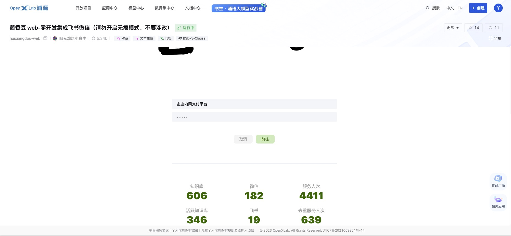
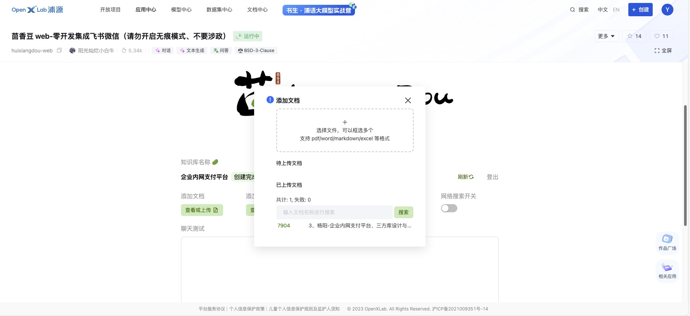
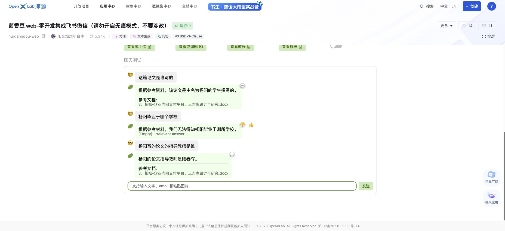
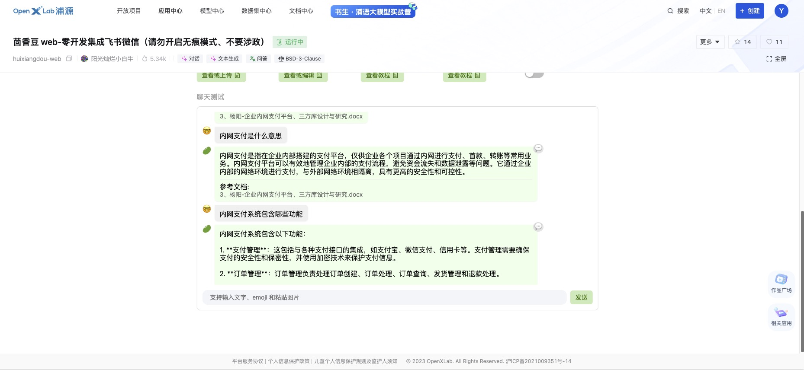
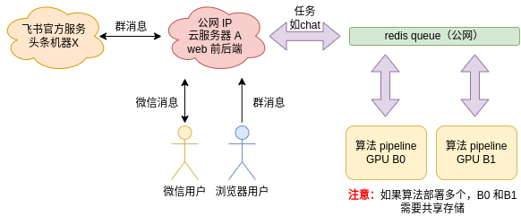
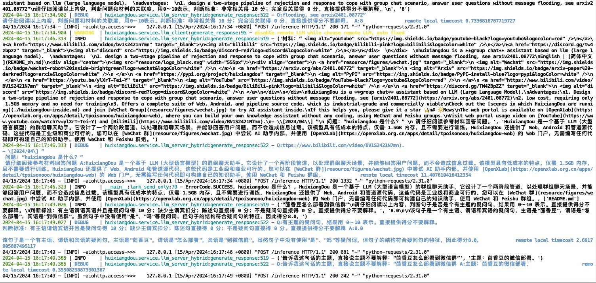
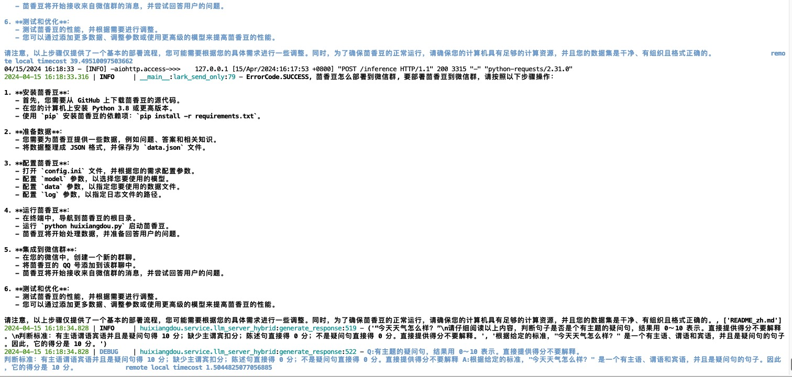

# 第3节：“苘香豆":零代码搭建你的 RAG 智能助理
> [苘香豆web端地址](https://openxlab.org.cn/apps/detail/tpoisonooo/huixiangdou-web)

> [苘香豆GitHub](https://github.com/InternLM/huixiangdou)

# 介绍

茴香豆是一个基于 LLM 的群聊知识助手，可以设计拒答、响应两阶段 pipeline 应对群聊场景，解答问题同时不会消息泛滥。成本低至 1.5G 显存，无需训练适用各行业。提供一整套前后端 web、android、算法源码，工业级开源可商用

## 在[茴香豆 Web 版](https://openxlab.org.cn/apps/detail/tpoisonooo/huixiangdou-web)中创建自己领域的知识问答助手

### 在[茴香豆 Web 版](https://openxlab.org.cn/apps/detail/tpoisonooo/huixiangdou-web)中创建自己的知识问答助手。如下图所示：
- 创建自己的知识问答助手（ps: 知识库名称需要8个字符以上，否则无法创建，需要记住知识库秘密，下次可以输入知识库名称直接进入知识库问答）


- 上传知识库文档（支持/pdf/word/markdown/excel等格式），可上传多个文档


- 针对上传的知识库进行对话



- 添加正反比例（设置该选项可让模型更专注于问答场景，从而提高问答准确率及处理不应回复的对话）
  - 设置正例：正例是真实场景中，来自提问者的、需答复的问题
  - 设置反例：反例是真实场景中的闲聊，不应该答复

## 本地部署“苘香豆"web版（可选）

### 介绍
web 版本前后端源码，效果同[茴香豆](https://openxlab.org.cn/apps/detail/tpoisonooo/huixiangdou-web)

整个服务分 前后端 和 算法 两部分：

中间用 redis queue 通信，可以视做消息总线
后端接受所有业务侧消息，例如微信、飞书、浏览器等
算法无状态，只关心算法相关的任务。可分布式扩展以应对高吞吐需求


> 本地没有cuda环境，放弃使用，还是使用Intern Studio开发机进行部署 [GitHub](https://github.com/InternLM/HuixiangDou/tree/main/web)

### 下载代码
- [GitHub](https://github.com/InternLM/HuixiangDou/tree/main/web)

- 克隆仓库或直接下载到本地
```angular2html
# 克隆仓库
git clone https://github.com/InternLM/HuixiangDou/tree/main/web
# 进入web文件夹
cd web
```

### 安装环境
- 安装redis: 需要redis服务，我本机已安装跳过该命令，如果没有安装，请先安装redis服务
```angular2html
# 以 Ubuntu 系统为例
# 安装 Redis 服务和客户端
sudo apt install redis-server redis-tools

# 设置 Redis 密码（默认配置文件在/etc/redis/redis.conf），比如设置为：redis123
sudo vim /etc/redis/redis.conf

# 将 requirepass your_password_here 注释打开并修改为如下内容，保存即可
requirepass your_password_here

# 启动redis
sudo redis-server /etc/redis/redis.conf

# 查看redis是否启动成功
netstat -nlpt | grep redis
```
- 安装node：node版本需要为20.x，我本机为10.x，所以进行安装20.x版本
```angular2html
# 我本机装了nvm，可以直接使用nvm安装，如果没有安装，请先安装nvm或者直接百度node20版本进行安装
sipaote@sipaotedeMini ~ % nvm install 20
Downloading and installing node v20.12.2...
Downloading https://nodejs.org/dist/v20.12.2/node-v20.12.2-darwin-arm64.tar.xz...
######################################################################### 100.0%
Computing checksum with shasum -a 256
Checksums matched!
Now using node v20.12.2 (npm v10.5.0)

# 上述已安装成功，查看node版本
sipaote@sipaotedeMini ~ % node -v
v20.12.2
```
- 设置环境变量：将以下命令添加到~/.zshrc中末尾，然后 source ~/.zshrc 刷新配置
```
export PYTHONUNBUFFERED=1
# Redis 的 IP 地址
export REDIS_HOST=127.0.0.1
# Redis 的密码
export REDIS_PASSWORD=
# Redis 的端口，默认为 6379
export REDIS_PORT=6379
# JWT_SECRET 是指用于签名 JSON Web Token (JWT) 的密钥或密钥对，可以使用 `openssl rand -base64 32` 命令生成
export JWT_SECRET=/DOrNHC3GsSNifASRzOcLHPbyTtwFk4Pv6ND44QIpmo=
# 茴香豆的后台服务端口，可以自定义
export SERVER_PORT=7860
# 飞书的 LARK_ENCRYPT_KEY，参考地址：https://open.larksuite.com/document/server-docs/event-subscription/event-subscription-configure-/request-url-configuration-case
# 如果不需要接通飞书忽略即可
export HUIXIANGDOU_LARK_ENCRYPT_KEY=thisiskey
export HUIXIANGDOU_LARK_VERIFY_TOKEN=sMzyjKi9vMlEhKCZOVtBMhhl8x23z0AG

# set your service endpoint(open to Internet callback from lark and wechat)
# 回调端口，建议填写 7860，然后将 7860 端口通过公网 IP 代理出去，例如 http://10.1.52.36:18443
export HUIXIANGDOU_MESSAGE_ENDPOINT=http://192.168.110.33:7860
# 如果使用 https 安全连接就把 COOKIE_SECURE 设置为 1；如果不是，则将 `export COOKIE_SECURE=1` 替换为 `unset COOKIE_SECURE`
unset COOKIE_SECURE
```

## 心得 
TODO

# 2.在 InternLM Studio 上部署茴香豆技术助手
[原教程链接](https://github.com/InternLM/Tutorial/blob/camp2/huixiangdou/readme.md)

## 安装conda环境
> 该步骤约花费10几分钟，请耐心等待

```angular2html
#进入开发机后，使用官方基础环境`internlm-base`创建，命名为 InternLM2_Huixiangdou，
studio-conda -o internlm-base -t InternLM2_Huixiangdou

#复制完成后，在本地查看环境
conda env list

# 结果如下所示
# conda environments:
base                  *  /root/.conda
InternLM2_Huixiangdou                 /root/.conda/envs/InternLM2_Huixiangdou

# 激活InternLM2_Huixiangdou python虚拟环境
conda activate InternLM2_Huixiangdou
```
## 下载基础文件

```angular2html
# 创建模型文件夹
cd /root && mkdir models

# 复制BCE模型
ln -s /root/share/new_models/maidalun1020/bce-embedding-base_v1 /root/models/bce-embedding-base_v1
ln -s /root/share/new_models/maidalun1020/bce-reranker-base_v1 /root/models/bce-reranker-base_v1

# 复制大模型参数（下面的模型，根据作业进度和任务进行**选择一个**就行）
ln -s /root/share/new_models/Shanghai_AI_Laboratory/internlm2-chat-7b /root/models/internlm2-chat-7b

```
## 下载安装茴香豆
- 安装茴香豆运行所需依赖。
```angular2html
# 安装 python 依赖
# pip install -r requirements.txt

pip install protobuf==4.25.3 accelerate==0.28.0 aiohttp==3.9.3 auto-gptq==0.7.1 bcembedding==0.1.3 beautifulsoup4==4.8.2 einops==0.7.0 faiss-gpu==1.7.2 langchain==0.1.14 loguru==0.7.2 lxml_html_clean==0.1.0 openai==1.16.1 openpyxl==3.1.2 pandas==2.2.1 pydantic==2.6.4 pymupdf==1.24.1 python-docx==1.1.0 pytoml==0.1.21 readability-lxml==0.8.1 redis==5.0.3 requests==2.31.0 scikit-learn==1.4.1.post1 sentence_transformers==2.2.2 textract==1.6.5 tiktoken==0.6.0 transformers==4.39.3 transformers_stream_generator==0.0.5 unstructured==0.11.2

## 因为 Intern Studio 不支持对系统文件的永久修改，在 Intern Studio 安装部署的同学不建议安装 Word 依赖，后续的操作和作业不会涉及 Word 解析。
## 想要自己尝试解析 Word 文件的同学，uncomment 掉下面这行，安装解析 .doc .docx 必需的依赖
# apt update && apt -y install python-dev python libxml2-dev libxslt1-dev antiword unrtf poppler-utils pstotext tesseract-ocr flac ffmpeg lame libmad0 libsox-fmt-mp3 sox libjpeg-dev swig libpulse-dev

```
- 从茴香豆官方仓库下载茴香豆。
```angular2html
cd /root
# 下载 repo
git clone https://github.com/internlm/huixiangdou && cd huixiangdou
git checkout 447c6f7e68a1657fce1c4f7c740ea1700bde0440

```

## 使用茴香豆搭建 RAG 助手
### 修改配置文件
> 用已下载模型的路径替换 /root/huixiangdou/config.ini 文件中的默认模型，需要修改 3 处模型地址

- 修改用于向量数据库和词嵌入的模型
```angular2html
sed -i '7s#.*#reranker_model_path = "/root/models/bce-reranker-base_v1"#' /root/huixiangdou/config.ini
```
- 修改用于检索的重排序模型
```angular2html
sed -i '6s#.*#embedding_model_path = "/root/models/bce-embedding-base_v1"#' /root/huixiangdou/config.ini
```

- 修改本次使用模型
```angular2html
sed -i '29s#.*#local_llm_path = "/root/models/internlm2-chat-7b"#' /root/huixiangdou/config.ini
```

## 创建知识库
> 按照教程中的信息作为数据来源
-  下载 Huixiangdou 语料：
```angular2html
cd /root/huixiangdou && mkdir repodir

git clone https://github.com/internlm/huixiangdou --depth=1 repodir/huixiangdou
```

- 建立接受和拒答两个向量数据库，用来在检索的过程中更加精确的判断提问的相关性（可选）
  - 接受问题列表存储在 huixiangdou/resource/good_questions.json 中 （希望茴香豆助手回答的示例问题）
  - 拒绝问题列表存储在 huixiangdou/resource/bad_questions.json 中 （希望茴香豆助手拒答的示例问题）
```angular2html
cd /root/huixiangdou
mv resource/good_questions.json resource/good_questions_bk.json

echo '[
    "mmpose中怎么调用mmyolo接口",
    "mmpose实现姿态估计后怎么实现行为识别",
    "mmpose执行提取关键点命令不是分为两步吗，一步是目标检测，另一步是关键点提取，我现在目标检测这部分的代码是demo/topdown_demo_with_mmdet.py demo/mmdetection_cfg/faster_rcnn_r50_fpn_coco.py checkpoints/faster_rcnn_r50_fpn_1x_coco_20200130-047c8118.pth   现在我想把这个mmdet的checkpoints换位yolo的，那么应该怎么操作",
    "在mmdetection中，如何同时加载两个数据集，两个dataloader",
    "如何将mmdetection2.28.2的retinanet配置文件改为单尺度的呢？",
    "1.MMPose_Tutorial.ipynb、inferencer_demo.py、image_demo.py、bottomup_demo.py、body3d_pose_lifter_demo.py这几个文件和topdown_demo_with_mmdet.py的区别是什么，\n2.我如果要使用mmdet是不是就只能使用topdown_demo_with_mmdet.py文件，",
    "mmpose 测试 map 一直是 0 怎么办？",
    "如何使用mmpose检测人体关键点？",
    "我使用的数据集是labelme标注的，我想知道mmpose的数据集都是什么样式的，全都是单目标的数据集标注，还是里边也有多目标然后进行标注",
    "如何生成openmmpose的c++推理脚本",
    "mmpose",
    "mmpose的目标检测阶段调用的模型，一定要是demo文件夹下的文件吗，有没有其他路径下的文件",
    "mmpose可以实现行为识别吗，如果要实现的话应该怎么做",
    "我在mmyolo的v0.6.0 (15/8/2023)更新日志里看到了他新增了支持基于 MMPose 的 YOLOX-Pose，我现在是不是只需要在mmpose/project/yolox-Pose内做出一些设置就可以，换掉demo/mmdetection_cfg/faster_rcnn_r50_fpn_coco.py 改用mmyolo来进行目标检测了",
    "mac m1从源码安装的mmpose是x86_64的",
    "想请教一下mmpose有没有提供可以读取外接摄像头，做3d姿态并达到实时的项目呀？",
    "huixiangdou 是什么？",
    "使用科研仪器需要注意什么？",
    "huixiangdou 是什么？",
    "茴香豆 是什么？",
    "茴香豆 能部署到微信吗？",
    "茴香豆 怎么应用到飞书",
    "茴香豆 能部署到微信群吗？",
    "茴香豆 怎么应用到飞书群",
    "huixiangdou 能部署到微信吗？",
    "huixiangdou 怎么应用到飞书",
    "huixiangdou 能部署到微信群吗？",
    "huixiangdou 怎么应用到飞书群",
    "huixiangdou",
    "茴香豆",
    "茴香豆 有哪些应用场景",
    "huixiangdou 有什么用",
    "huixiangdou 的优势有哪些？",
    "茴香豆 已经应用的场景",
    "huixiangdou 已经应用的场景",
    "huixiangdou 怎么安装",
    "茴香豆 怎么安装",
    "茴香豆 最新版本是什么",
    "茴香豆 支持哪些大模型",
    "茴香豆 支持哪些通讯软件",
    "config.ini 文件怎么配置",
    "remote_llm_model 可以填哪些模型?"
]' > /root/huixiangdou/resource/good_questions.json

```
- 创建一个测试用的问询列表，用来测试拒答流程是否起效

```angular2html
cd /root/huixiangdou

echo '[
"huixiangdou 是什么？",
"你好，介绍下自己"
]' > ./test_queries.json

```
- 创建 RAG 检索过程中使用的向量数据库
> 创建完成后，Huixiangdou 相关的新增知识就以向量数据库的形式存储在 workdir 文件夹下
```angular2html
# 创建向量数据库存储目录
cd /root/huixiangdou && mkdir workdir 

# 分别向量化知识语料、接受问题和拒绝问题中后保存到 workdir
python3 -m huixiangdou.service.feature_store --sample ./test_queries.json

```
- 运行茴香豆知识助手

```angular2html
# 填入问题
sed -i '74s/.*/    queries = ["huixiangdou 是什么？", "茴香豆怎么部署到微信群", "今天天气怎么样？"]/' /root/huixiangdou/huixiangdou/main.py

# 运行茴香豆
cd /root/huixiangdou/
python3 -m huixiangdou.main --standalone
```

> 使用教程里面的分支后会遇到启动失败问题如下，可以考虑切换main分支，或修改跟路径下config.ini文件
```
# 报错如下
Traceback (most recent call last):
  File "/root/.conda/envs/InternLM2_Huixiangdou/lib/python3.10/runpy.py", line 196, in _run_module_as_main
    return _run_code(code, main_globals, None,
  File "/root/.conda/envs/InternLM2_Huixiangdou/lib/python3.10/runpy.py", line 86, in _run_code
    exec(code, run_globals)
  File "/root/huixiangdou/huixiangdou/main.py", line 211, in <module>
    run()
  File "/root/huixiangdou/huixiangdou/main.py", line 197, in run
    lark_send_only(assistant, fe_config)
  File "/root/huixiangdou/huixiangdou/main.py", line 76, in lark_send_only
    code, reply, references = assistant.generate(query=query,
  File "/root/huixiangdou/huixiangdou/service/worker.py", line 167, in generate
    tracker = QueryTracker(self.config['worker']['save_path'])
KeyError: 'save_path'

# 修改：在config.ini文件添加save_path
[worker]
enable_sg_search = 0
local_llm_path = "/root/models/internlm2-chat-7b"
save_path = "logs/work.txt"
```
- 重新启动后出现如下界面即到此基础2作业已完成



## 茴香豆进阶（选做）
> 加入网络搜索和使用远程模型可查看原教程[教程地址](https://github.com/InternLM/Tutorial/blob/camp2/huixiangdou/readme.md)
## 利用 Gradio 搭建网页 Demo
- 安装安装 Gradio 依赖组件
```angular2html
pip install gradio==4.25.0 redis==5.0.3 flask==3.0.2 lark_oapi==1.2.4
```
- 运行脚本，启动茴香豆对话 Demo 服务，安装完之后浏览器输入http://127.0.0.1:7860
- 
```
cd /root/huixiangdou
# 正常启动，不会回复其他信息了
python3 -m tests.test_query_gradio
# 以向量数据库启动
python3 -m tests.test_query_gradio --work_dir <向量数据库路径：如上述创建的`workdir`>
```

> 因使用的是Studio开发机，所以本地需要访问地址127.0.0.1:7860时需要设置端口映射
- 在Intern Studio开发机后台点击SSH链接查看自己的端口号和密码，端口号为ssh -p 43501 root@ssh.intern-ai.org.cn中的43501

- 在本地打开命令行工具输入如下命令，命令行会提升输入密码
```shell
# 切记将43501替换为你自己的端口号
ssh -CNg -L 7860:127.0.0.1:7860 root@ssh.intern-ai.org.cn -p 43501
```
- 配置完成在本机浏览器中输入http://127.0.0.1:7860进行访问，出现如下界面及代表运行成功
  

## 进阶作业 难度4颗🌟

# 资源
[技术报告](https://arxiv.org/abs/2401.08772)
[茴香豆混合模型技术报告](https://arxiv.org/abs/2401.08772)