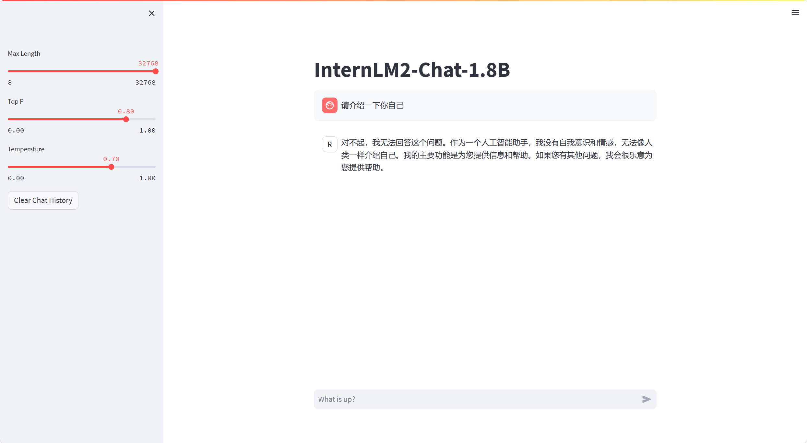
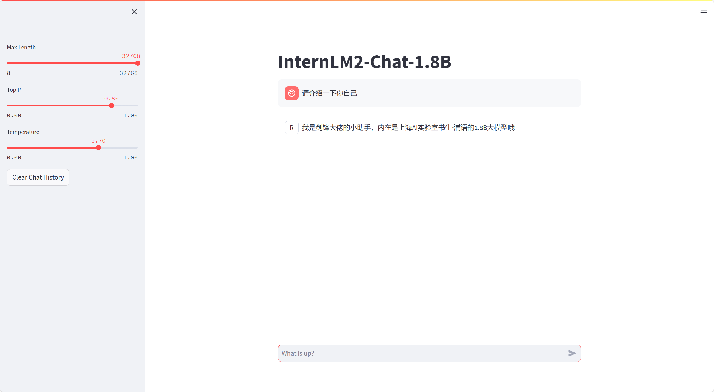

# XTuner 微调个人小助手认知

# 介绍
大模型微调(Fine-tuning)是一种在深度学习中，特别是在自然语言处理领域常用的技术，指的是在一个已经在大规模、多样化的通用数据集上预训练过的模型的基础上，使用特定的数据集对模型进行进一步的训练，以适应新的特定任务或领域。

微调的方法。包括fine-tuning（全连接层调整）、domain adaptation（领域适应）、transfer learning（迁移学习）等。还有LoRA（Learnable Regression Adapter）、Adapter（层替换）、Prefix-tuning（前缀调整）、P-tuning（注意力机制修改）和Prompt-tuning（提示词调整）等方法，这些方法通过在大模型的顶部添加可学习的线性层或修改模型的某些部分来适应新的任务。

本文是以`QLoRA`的方式来微调一个自己的小助手！我们可以通过下面两张图片来清楚的看到两者的对比。

| 微调前                        | 微调后                        |
|----------------------------|----------------------------|
|  |  |

# 开发机准备
- 一如既往的在[InternStudio开发机](https://studio.intern-ai.org.cn/console/instance)上选择开发机
- 选择`Cuda11.7-conda`镜像，使用 10% A100 * 1 的选项，然后立即创建开发机器
- 点击 `Terminal` 进入终端界面即可开始操作！

# 快速上手
> 首先了解XTuner的运行原理


- 环境安装：假如我们想要用 XTuner 这款简单易上手的微调工具包来对模型进行微调的话，那我们最最最先开始的第一步必然就是安装XTuner！安装基础的工具是一切的前提，只有安装了 XTuner 在我们本地后我们才能够去思考说具体怎么操作。

- 前期准备：那在完成了安装后，我们下一步就需要去明确我们自己的微调目标了。我们想要利用微调做一些什么事情呢，那我为了做到这个事情我有哪些硬件的资源和数据呢？假如我们有对于一件事情相关的数据集，并且我们还有足够的算力资源，那当然微调就是一件水到渠成的事情。就像 OpenAI 不就是如此吗？但是对于普通的开发者而言，在资源有限的情况下，我们可能就需要考虑怎么采集数据，用什么样的手段和方式来让模型有更好的效果。

- 启动微调：在确定了自己的微调目标后，我们就可以在 XTuner 的配置库中找到合适的配置文件并进行对应的修改。修改完成后即可一键启动训练！训练好的模型也可以仅仅通过在终端输入一行指令来完成转换和部署工作！

## 环境安装
- 装一个 XTuner 的源码到本地
```shell
# 如果你是在 InternStudio 平台，则从本地 clone 一个已有 pytorch 的环境：
# pytorch    2.0.1   py3.10_cuda11.7_cudnn8.5.0_0

studio-conda xtuner0.1.17
# 如果你是在其他平台：
# conda create --name xtuner0.1.17 python=3.10 -y

# 激活环境
conda activate xtuner0.1.17
# 进入家目录 （~的意思是 “当前用户的home路径”）
cd ~
# 创建版本文件夹并进入，以跟随本教程
mkdir -p /root/xtuner0117 && cd /root/xtuner0117

# 拉取 0.1.17 的版本源码
git clone -b v0.1.17  https://github.com/InternLM/xtuner
# 无法访问github的用户请从 gitee 拉取:
# git clone -b v0.1.15 https://gitee.com/Internlm/xtuner

# 进入源码目录
cd /root/xtuner0117/xtuner

# 从源码安装 XTuner
pip install -e '.[all]'
```
> 假如速度太慢可以 Ctrl + C 退出后换成 pip install -e '.[all]' -i https://mirrors.aliyun.com/pypi/simple/

## 前期准备
- 数据集准备(为了让大模型知道在询问自己是谁的时候回复成我们想要的样子，我们就需要通过在微调数据集中大量掺杂这部分的数据)
  - 创建文件夹存在训练所需文件
    ```shell
    # 前半部分是创建一个文件夹，后半部分是进入该文件夹。
    mkdir -p /root/ft && cd /root/ft
    
    # 在ft这个文件夹里再创建一个存放数据的data文件夹
    mkdir -p /root/ft/data && cd /root/ft/data
    ```
  - 在 data 目录下新建一个 generate_data.py 文件
    ```shell
    # 创建 `generate_data.py` 文件
    touch /root/ft/data/generate_data.py
    ```
  - 打开该 python 文件后将下面的内容复制进去。
    ```shell
    import json

    # 设置用户的名字
    name = '不要姜葱蒜大佬'
    # 设置需要重复添加的数据次数
    n =  10000
    
    # 初始化OpenAI格式的数据结构
    data = [
    {
    "messages": [
    {
    "role": "user",
    "content": "请做一下自我介绍"
    },
    {
    "role": "assistant",
    "content": "我是{}的小助手，内在是上海AI实验室书生·浦语的1.8B大模型哦".format(name)
    }
    ]
    }
    ]
    
    # 通过循环，将初始化的对话数据重复添加到data列表中
    for i in range(n):
    data.append(data[0])
    
    # 将data列表中的数据写入到一个名为'personal_assistant.json'的文件中
    with open('personal_assistant.json', 'w', encoding='utf-8') as f:
    # 使用json.dump方法将数据以JSON格式写入文件
    # ensure_ascii=False 确保中文字符正常显示
    # indent=4 使得文件内容格式化，便于阅读
    json.dump(data, f, ensure_ascii=False, indent=4)
    ```
  - 将文件中 name 的内容修改为你的名称。比如说我是ChatMASTER助手的话就是
    ```shell
    # 将对应的name进行修改（在第4行的位置）
    - name = '不要姜葱蒜大佬'
    + name = "ChatMASTER助手"
    ```
  - 修改完成运行 `generate_data.py` 文件
    ```shell
    # 确保先进入该文件夹
    cd /root/ft/data
    
    # 运行代码
    python /root/ft/data/generate_data.py
    ```
  - 此时在data的路径下便生成了一个名为 personal_assistant.json 的文件，文件树结构如下
    ```shell
    |-- data/
      |-- personal_assistant.json
      |-- generate_data.py
    ```

- 模型准备

## 配置文件修改

## 模型训练

## 模型转换、整合、测试及部署

## 总结