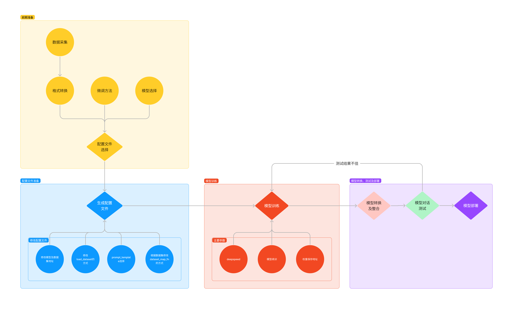

# XTuner 微调个人小助手认知

[GitHub](https://github.com/InternLM/xtuner)
[教程](https://github.com/InternLM/Tutorial/blob/camp2/xtuner/readme.md)

# 介绍
大模型微调(Fine-tuning)是一种在深度学习中，特别是在自然语言处理领域常用的技术，指的是在一个已经在大规模、多样化的通用数据集上预训练过的模型的基础上，使用特定的数据集对模型进行进一步的训练，以适应新的特定任务或领域。

微调的方法。包括fine-tuning（全连接层调整）、domain adaptation（领域适应）、transfer learning（迁移学习）等。还有LoRA（Learnable Regression Adapter）、Adapter（层替换）、Prefix-tuning（前缀调整）、P-tuning（注意力机制修改）和Prompt-tuning（提示词调整）等方法，这些方法通过在大模型的顶部添加可学习的线性层或修改模型的某些部分来适应新的任务。

本文是以`QLoRA`的方式来微调一个自己的小助手！我们可以通过下面两张图片来清楚的看到两者的对比。

| 微调前                        | 微调后                        |
|----------------------------|:---------------------------|
|  |  |

# 开发机准备
> 到Note4的时候我们就跳过创建InternStudio开发机步骤了，相信大家和我一样已经熟悉conda环境的激活及开发机的操作了，如已忘记可以查看之前笔记或者直接查看[这里](https://github.com/InternLM/Tutorial/blob/camp2/xtuner/personal_assistant_document.md)

- 一如既往的在[InternStudio开发机](https://studio.intern-ai.org.cn/console/instance)上选择开发机
- 选择`Cuda11.7-conda`镜像，使用 10% A100 * 1 的选项，然后立即创建开发机器
- 点击 `Terminal` 进入终端界面即可开始操作！

# 快速上手
> 首先了解XTuner的运行原理



- 环境安装：假如我们想要用 XTuner 这款简单易上手的微调工具包来对模型进行微调的话，那我们最最最先开始的第一步必然就是安装XTuner！安装基础的工具是一切的前提，只有安装了 XTuner 在我们本地后我们才能够去思考说具体怎么操作。

- 前期准备：那在完成了安装后，我们下一步就需要去明确我们自己的微调目标了。我们想要利用微调做一些什么事情呢，那我为了做到这个事情我有哪些硬件的资源和数据呢？假如我们有对于一件事情相关的数据集，并且我们还有足够的算力资源，那当然微调就是一件水到渠成的事情。就像 OpenAI 不就是如此吗？但是对于普通的开发者而言，在资源有限的情况下，我们可能就需要考虑怎么采集数据，用什么样的手段和方式来让模型有更好的效果。

- 启动微调：在确定了自己的微调目标后，我们就可以在 XTuner 的配置库中找到合适的配置文件并进行对应的修改。修改完成后即可一键启动训练！训练好的模型也可以仅仅通过在终端输入一行指令来完成转换和部署工作！

## 环境安装
- 装一个 XTuner 的源码到本地
```shell
# 如果你是在 InternStudio 平台，则从本地 clone 一个已有 pytorch 的环境：
# pytorch    2.0.1   py3.10_cuda11.7_cudnn8.5.0_0

studio-conda xtuner0.1.17
# 如果你是在其他平台：
# conda create --name xtuner0.1.17 python=3.10 -y

# 激活环境
conda activate xtuner0.1.17
# 进入家目录 （~的意思是 “当前用户的home路径”）
cd ~
# 创建版本文件夹并进入，以跟随本教程
mkdir -p /root/xtuner0117 && cd /root/xtuner0117

# 拉取 0.1.17 的版本源码
git clone -b v0.1.17  https://github.com/InternLM/xtuner
# 无法访问github的用户请从 gitee 拉取:
# git clone -b v0.1.15 https://gitee.com/Internlm/xtuner

# 进入源码目录
cd /root/xtuner0117/xtuner

# 从源码安装 XTuner
pip install -e '.[all]'
```
> 假如速度太慢可以 Ctrl + C 退出后换成 pip install -e '.[all]' -i https://mirrors.aliyun.com/pypi/simple/

## 前期准备
- 数据集准备(为了让大模型知道在询问自己是谁的时候回复成我们想要的样子，我们就需要通过在微调数据集中大量掺杂这部分的数据)
  - 创建文件夹存在训练所需文件
    ```shell
    # 前半部分是创建一个文件夹，后半部分是进入该文件夹。
    mkdir -p /root/ft && cd /root/ft
    
    # 在ft这个文件夹里再创建一个存放数据的data文件夹
    mkdir -p /root/ft/data && cd /root/ft/data
    ```
  - 在 data 目录下新建一个 generate_data.py 文件
    ```shell
    # 创建 `generate_data.py` 文件
    touch /root/ft/data/generate_data.py
    ```
  - 打开该 python 文件后将下面的内容复制进去。
    ```shell
    import json

    # 设置用户的名字
    name = '不要姜葱蒜大佬'
    # 设置需要重复添加的数据次数
    n =  10000
    
    # 初始化OpenAI格式的数据结构
    data = [
    {
    "messages": [
    {
    "role": "user",
    "content": "请做一下自我介绍"
    },
    {
    "role": "assistant",
    "content": "我是{}的小助手，内在是上海AI实验室书生·浦语的1.8B大模型哦".format(name)
    }
    ]
    }
    ]
    
    # 通过循环，将初始化的对话数据重复添加到data列表中
    for i in range(n):
    data.append(data[0])
    
    # 将data列表中的数据写入到一个名为'personal_assistant.json'的文件中
    with open('personal_assistant.json', 'w', encoding='utf-8') as f:
    # 使用json.dump方法将数据以JSON格式写入文件
    # ensure_ascii=False 确保中文字符正常显示
    # indent=4 使得文件内容格式化，便于阅读
    json.dump(data, f, ensure_ascii=False, indent=4)
    ```
  - 将文件中 name 的内容修改为你的名称。比如说我是ChatMASTER助手的话就是
    ```shell
    # 将对应的name进行修改（在第4行的位置）
    - name = '不要姜葱蒜大佬'
    + name = "ChatMASTER助手"
    ```
  - 修改完成运行 `generate_data.py` 文件
    ```shell
    # 确保先进入该文件夹
    cd /root/ft/data
    
    # 运行代码
    python /root/ft/data/generate_data.py
    ```
  - 此时在data的路径下便生成了一个名为 personal_assistant.json 的文件，文件树结构如下
    ```shell
    |-- data/
      |-- personal_assistant.json
      |-- generate_data.py
    ```

- 模型准备
> 该教程使用 `InterLM2-Chat-1.8B` 模型进行微调，因为我们使用的是 `InternStudio` 的开发机，里面已经有了该模型，所以无需再从 [OpenXLab](https://openxlab.org.cn/models) 或者 [Modelscope](https://modelscope.cn/home) 模型社区进行模型的下载。

1. 创建模型文件夹 并且从开发机中复制模型到模型文件夹
```shell
# 创建目标文件夹，确保它存在。
# -p选项意味着如果上级目录不存在也会一并创建，且如果目标文件夹已存在则不会报错。
mkdir -p /root/ft/model

# 复制内容到目标文件夹。-r选项表示递归复制整个文件夹。
cp -r /root/share/new_models/Shanghai_AI_Laboratory/internlm2-chat-1_8b/* /root/ft/model/
```
2. 执行完可以看到在 model 文件夹下保存了模型的相关文件和内容了

```shell
|-- model/
    |-- tokenizer.model
    |-- config.json
    |-- tokenization_internlm2.py
    |-- model-00002-of-00002.safetensors
    |-- tokenizer_config.json
    |-- model-00001-of-00002.safetensors
    |-- model.safetensors.index.json
    |-- configuration.json
    |-- special_tokens_map.json
    |-- modeling_internlm2.py
    |-- README.md
    |-- configuration_internlm2.py
    |-- generation_config.json
    |-- tokenization_internlm2_fast.py
```

- 配置文件选择
> 配置文件是为了控制模型训练和测试过程的一些参数而设置的，准备好的配置文件运行起来就代表模型开始训练和微调了

1. XTuner 提供多个开箱即用的配置文件 (开箱即用意味着假如能够连接上 Huggingface 以及有足够的显存，其实就可以直接运行这些配置文件)
```shell
# 列出所有内置配置文件
# xtuner list-cfg

# 假如我们想找到 internlm2-1.8b 模型里支持的配置文件
(xtuner0.1.17) root@intern-studio-40071654:~/ft# xtuner list-cfg -p internlm2_1_8b
==========================CONFIGS===========================
PATTERN: internlm2_1_8b
-------------------------------
internlm2_1_8b_full_alpaca_e3
internlm2_1_8b_qlora_alpaca_e3
=============================================================
```

2. 配置文件名介绍，以 `internlm2_1_8b_qlora_alpaca_e3` 举例：

| 模型名                      | 说明                         |
|--------------------------|----------------------------|
| internlm2_1_8b| 模型名称 |
| qlora| 使用的算法 |
| alpaca| 数据集名称 |
| e3| 把数据集跑3次 |
	
3. 拷贝配置文件到当前目录

```shell
# 创建一个存放 config 文件的文件夹
mkdir -p /root/ft/config

# 使用 XTuner 中的 copy-cfg 功能将 config 文件复制到指定的位置
xtuner copy-cfg internlm2_1_8b_qlora_alpaca_e3 /root/ft/config
```
4. 小结

 完成以上内容后，那么基本的准备工作就已经完成了。已完成的内容有：
- 在 GitHub 上克隆了 XTuner 的源码，并把相关的配套库也通过 pip 的方式进行了安装。
- 根据自己想要做的事情，利用脚本准备好了一份关于调教模型认识自己身份弟位的数据集。
- 根据自己的显存及任务情况确定了使用 InternLM2-chat-1.8B 这个模型，并且将其复制到我们的文件夹里。
- 最后在 XTuner 已有的配置文件中，根据微调方法、数据集和模型挑选出最合适的配置文件并复制到我们新建的文件夹中。

## 配置文件修改
> 每个人实际的运行机器及训练数据大小包括训练内容不同，可以修改配置文件，来满足适合自己的训练。
- 可以直接如下代码直接复制到`/root/ft/config/internlm2_1_8b_qlora_alpaca_e3_copy.py`文件中，需删除原先文件中的所有内容
```shell
# Copyright (c) OpenMMLab. All rights reserved.
import torch
from datasets import load_dataset
from mmengine.dataset import DefaultSampler
from mmengine.hooks import (CheckpointHook, DistSamplerSeedHook, IterTimerHook,
                            LoggerHook, ParamSchedulerHook)
from mmengine.optim import AmpOptimWrapper, CosineAnnealingLR, LinearLR
from peft import LoraConfig
from torch.optim import AdamW
from transformers import (AutoModelForCausalLM, AutoTokenizer,
                          BitsAndBytesConfig)

from xtuner.dataset import process_hf_dataset
from xtuner.dataset.collate_fns import default_collate_fn
# 把 OpenAI 格式的 map_fn 载入进来
from xtuner.dataset.map_fns import openai_map_fn, template_map_fn_factory
from xtuner.engine.hooks import (DatasetInfoHook, EvaluateChatHook,
                                 VarlenAttnArgsToMessageHubHook)
from xtuner.engine.runner import TrainLoop
from xtuner.model import SupervisedFinetune
from xtuner.parallel.sequence import SequenceParallelSampler
from xtuner.utils import PROMPT_TEMPLATE, SYSTEM_TEMPLATE

#######################################################################
#                          PART 1  Settings                           #
#######################################################################
# Model
# 修改模型地址
pretrained_model_name_or_path = '/root/ft/model'
use_varlen_attn = False

# Data
# 修改数据集地址为本地的json文件地址
alpaca_en_path = '/root/ft/data/personal_assistant.json'
prompt_template = PROMPT_TEMPLATE.default
# 修改max_length来降低显存的消耗
max_length = 1024
pack_to_max_length = True

# parallel
sequence_parallel_size = 1

# Scheduler & Optimizer
batch_size = 1  # per_device
accumulative_counts = 16
accumulative_counts *= sequence_parallel_size
dataloader_num_workers = 0
# 减少训练的轮数
max_epochs = 2
optim_type = AdamW
lr = 2e-4
betas = (0.9, 0.999)
weight_decay = 0
max_norm = 1  # grad clip
warmup_ratio = 0.03

# Save
save_steps = 300
# 增加保存权重文件的总数
save_total_limit = 3  # Maximum checkpoints to keep (-1 means unlimited)

# Evaluate the generation performance during the training
# 修改每多少轮进行一次评估
evaluation_freq = 300
SYSTEM = ''
# 修改具体评估的问题，可以自由拓展其他问题
evaluation_inputs = ['请你介绍一下你自己', '你是谁', '你是我的小助手吗']

#######################################################################
#                      PART 2  Model & Tokenizer                      #
#######################################################################
tokenizer = dict(
    type=AutoTokenizer.from_pretrained,
    pretrained_model_name_or_path=pretrained_model_name_or_path,
    trust_remote_code=True,
    padding_side='right')

model = dict(
    type=SupervisedFinetune,
    use_varlen_attn=use_varlen_attn,
    llm=dict(
        type=AutoModelForCausalLM.from_pretrained,
        pretrained_model_name_or_path=pretrained_model_name_or_path,
        trust_remote_code=True,
        torch_dtype=torch.float16,
        quantization_config=dict(
            type=BitsAndBytesConfig,
            load_in_4bit=True,
            load_in_8bit=False,
            llm_int8_threshold=6.0,
            llm_int8_has_fp16_weight=False,
            bnb_4bit_compute_dtype=torch.float16,
            bnb_4bit_use_double_quant=True,
            bnb_4bit_quant_type='nf4')),
    lora=dict(
        type=LoraConfig,
        r=64,
        lora_alpha=16,
        lora_dropout=0.1,
        bias='none',
        task_type='CAUSAL_LM'))

#######################################################################
#                      PART 3  Dataset & Dataloader                   #
#######################################################################
alpaca_en = dict(
    type=process_hf_dataset,
    # 将原本是 alpaca 的地址改为是 json 文件的地址
    dataset=dict(type=load_dataset, path='json', data_files=dict(train=alpaca_en_path)),
    tokenizer=tokenizer,
    max_length=max_length,
    # 将 dataset_map_fn 改为通用的 OpenAI 数据集格式
    dataset_map_fn=openai_map_fn,
    template_map_fn=dict(
        type=template_map_fn_factory, template=prompt_template),
    remove_unused_columns=True,
    shuffle_before_pack=True,
    pack_to_max_length=pack_to_max_length,
    use_varlen_attn=use_varlen_attn)

sampler = SequenceParallelSampler \
    if sequence_parallel_size > 1 else DefaultSampler
train_dataloader = dict(
    batch_size=batch_size,
    num_workers=dataloader_num_workers,
    dataset=alpaca_en,
    sampler=dict(type=sampler, shuffle=True),
    collate_fn=dict(type=default_collate_fn, use_varlen_attn=use_varlen_attn))

#######################################################################
#                    PART 4  Scheduler & Optimizer                    #
#######################################################################
# optimizer
optim_wrapper = dict(
    type=AmpOptimWrapper,
    optimizer=dict(
        type=optim_type, lr=lr, betas=betas, weight_decay=weight_decay),
    clip_grad=dict(max_norm=max_norm, error_if_nonfinite=False),
    accumulative_counts=accumulative_counts,
    loss_scale='dynamic',
    dtype='float16')

# learning policy
# More information: https://github.com/open-mmlab/mmengine/blob/main/docs/en/tutorials/param_scheduler.md  # noqa: E501
param_scheduler = [
    dict(
        type=LinearLR,
        start_factor=1e-5,
        by_epoch=True,
        begin=0,
        end=warmup_ratio * max_epochs,
        convert_to_iter_based=True),
    dict(
        type=CosineAnnealingLR,
        eta_min=0.0,
        by_epoch=True,
        begin=warmup_ratio * max_epochs,
        end=max_epochs,
        convert_to_iter_based=True)
]

# train, val, test setting
train_cfg = dict(type=TrainLoop, max_epochs=max_epochs)

#######################################################################
#                           PART 5  Runtime                           #
#######################################################################
# Log the dialogue periodically during the training process, optional
custom_hooks = [
    dict(type=DatasetInfoHook, tokenizer=tokenizer),
    dict(
        type=EvaluateChatHook,
        tokenizer=tokenizer,
        every_n_iters=evaluation_freq,
        evaluation_inputs=evaluation_inputs,
        system=SYSTEM,
        prompt_template=prompt_template)
]

if use_varlen_attn:
    custom_hooks += [dict(type=VarlenAttnArgsToMessageHubHook)]

# configure default hooks
default_hooks = dict(
    # record the time of every iteration.
    timer=dict(type=IterTimerHook),
    # print log every 10 iterations.
    logger=dict(type=LoggerHook, log_metric_by_epoch=False, interval=10),
    # enable the parameter scheduler.
    param_scheduler=dict(type=ParamSchedulerHook),
    # save checkpoint per `save_steps`.
    checkpoint=dict(
        type=CheckpointHook,
        by_epoch=False,
        interval=save_steps,
        max_keep_ckpts=save_total_limit),
    # set sampler seed in distributed evrionment.
    sampler_seed=dict(type=DistSamplerSeedHook),
)

# configure environment
env_cfg = dict(
    # whether to enable cudnn benchmark
    cudnn_benchmark=False,
    # set multi process parameters
    mp_cfg=dict(mp_start_method='fork', opencv_num_threads=0),
    # set distributed parameters
    dist_cfg=dict(backend='nccl'),
)

# set visualizer
visualizer = None

# set log level
log_level = 'INFO'

# load from which checkpoint
load_from = None

# whether to resume training from the loaded checkpoint
resume = False

# Defaults to use random seed and disable `deterministic`
randomness = dict(seed=None, deterministic=False)

# set log processor
log_processor = dict(by_epoch=False)
```
- 配置文件介绍(整体的配置文件分为如下五部分)

  1. Settings：涵盖了模型基本设置，如预训练模型的选择、数据集信息和训练过程中的一些基本参数（如批大小、学习率等）。

  2. Model & Tokenizer：指定了用于训练的模型和分词器的具体类型及其配置，包括预训练模型的路径和是否启用特定功能（如可变长度注意力），这是模型训练的核心组成部分。

  3. Dataset & Dataloader：描述了数据处理的细节，包括如何加载数据集、预处理步骤、批处理大小等，确保了模型能够接收到正确格式和质量的数据。

  4. Scheduler & Optimizer：配置了优化过程中的关键参数，如学习率调度策略和优化器的选择，这些是影响模型训练效果和速度的重要因素。

  5. Runtime：定义了训练过程中的额外设置，如日志记录、模型保存策略和自定义钩子等，以支持训练流程的监控、调试和结果的保存。

一般来说我们需要更改的部分其实只包括前三部分，而且修改的主要原因是我们修改了配置文件中规定的模型、数据集。后两部分都是 XTuner 官方帮我们优化好的东西，一般而言只有在魔改的情况下才需要进行修改。下面我们将根据项目的要求一步步的进行修改和调整吧！

- 参数修改细节（不用替换上述代码，上述代码已经包含，作为学习理解使用或亦可根据自己的需求进行修改）

  可直接查看原文链接[地址](https://github.com/InternLM/Tutorial/blob/camp2/xtuner/personal_assistant_document.md)

- 常用参数介绍

| 参数名                  | 解释                                                     |
| ----------------------- | -------------------------------------------------------- |
| **data_path**           | 数据路径或 HuggingFace 仓库名                             |
| **max_length**          | 单条数据最大 Token 数，超过则截断                         |
| **pack_to_max_length**  | 是否将多条短数据拼接到 max_length，提高 GPU 利用率        |
| **accumulative_counts** | 梯度累积，每多少次 backward 更新一次参数                  |
| **sequence_parallel_size** | 并行序列处理的大小，用于模型训练时的序列并行              |
| **batch_size**          | 每个设备上的批量大小                                      |
| **dataloader_num_workers** | 数据加载器中工作进程的数量                                |
| **max_epochs**          | 训练的最大轮数                                             |
| **optim_type**          | 优化器类型，例如 AdamW                                    |
| **lr**                  | 学习率                                                    |
| **betas**               | 优化器中的 beta 参数，控制动量和平方梯度的移动平均         |
| **weight_decay**        | 权重衰减系数，用于正则化和避免过拟合                      |
| **max_norm**            | 梯度裁剪的最大范数，用于防止梯度爆炸                      |
| **warmup_ratio**        | 预热的比例，学习率在这个比例的训练过程中线性增加到初始学习率 |
| **save_steps**          | 保存模型的步数间隔                                         |
| **save_total_limit**    | 保存的模型总数限制，超过限制时删除旧的模型文件             |
| **prompt_template**     | 模板提示，用于定义生成文本的格式或结构                    |
| ...... | ...... |

> 如果想把显卡的现存吃满，充分利用显卡资源，可以将 `max_length` 和 `batch_size` 这两个参数调大。


## 模型训练

- 常规训练  --work-dir 指定特定的文件保存位置，比如说就保存在 /root/ft/train 路径下
```shell
# 指定保存路径
xtuner train /root/ft/config/internlm2_1_8b_qlora_alpaca_e3_copy.py --work-dir /root/ft/train
```
  训练完后文件如下所示：
  ```
  |-- train/
    |-- internlm2_1_8b_qlora_alpaca_e3_copy.py
    |-- iter_600.pth
    |-- last_checkpoint
    |-- iter_768.pth
    |-- iter_300.pth
    |-- 20240406_203957/
        |-- 20240406_203957.log
        |-- vis_data/
            |-- 20240406_203957.json
            |-- eval_outputs_iter_599.txt
            |-- eval_outputs_iter_767.txt
            |-- scalars.json
            |-- eval_outputs_iter_299.txt
            |-- config.py
  ```


- 使用 deepspeed 来加速训练
```shell
# 使用 deepspeed 来加速训练
xtuner train /root/ft/config/internlm2_1_8b_qlora_alpaca_e3_copy.py --work-dir /root/ft/train_deepspeed --deepspeed deepspeed_zero2
```
通过 deepspeed 来训练后得到的权重文件和原本的权重文件是有所差别的，原本的仅仅是一个 .pth 的文件，而使用了 deepspeed 则是一个名字带有 .pth 的文件夹，在该文件夹里保存了两个 .pt 文件。
  ```
  |-- train_deepspeed/
    |-- internlm2_1_8b_qlora_alpaca_e3_copy.py
    |-- zero_to_fp32.py
    |-- last_checkpoint
    |-- iter_600.pth/
        |-- bf16_zero_pp_rank_0_mp_rank_00_optim_states.pt
        |-- mp_rank_00_model_states.pt
    |-- 20240406_220727/
        |-- 20240406_220727.log
        |-- vis_data/
            |-- 20240406_220727.json
            |-- eval_outputs_iter_599.txt
            |-- eval_outputs_iter_767.txt
            |-- scalars.json
            |-- eval_outputs_iter_299.txt
            |-- config.py
    |-- iter_768.pth/
        |-- bf16_zero_pp_rank_0_mp_rank_00_optim_states.pt
        |-- mp_rank_00_model_states.pt
    |-- iter_300.pth/
        |-- bf16_zero_pp_rank_0_mp_rank_00_optim_states.pt
        |-- mp_rank_00_model_states.pt
  ```

  - DeepSpeed优化器及其选择方法

    DeepSpeed是一个深度学习优化库，由微软开发，旨在提高大规模模型训练的效率和速度。它通过几种关键技术来优化训练过程，包括模型分割、梯度累积、以及内存和带宽优化等。DeepSpeed特别适用于需要巨大计算资源的大型模型和数据集。

    在DeepSpeed中，zero 代表“ZeRO”（Zero Redundancy Optimizer），是一种旨在降低训练大型模型所需内存占用的优化器。ZeRO 通过优化数据并行训练过程中的内存使用，允许更大的模型和更快的训练速度。ZeRO 分为几个不同的级别，主要包括：

    - deepspeed_zero1：这是ZeRO的基本版本，它优化了模型参数的存储，使得每个GPU只存储一部分参数，从而减少内存的使用。

    - deepspeed_zero2：在deepspeed_zero1的基础上，deepspeed_zero2进一步优化了梯度和优化器状态的存储。它将这些信息也分散到不同的GPU上，进一步降低了单个GPU的内存需求。

    - deepspeed_zero3：这是目前最高级的优化等级，它不仅包括了deepspeed_zero1和deepspeed_zero2的优化，还进一步减少了激活函数的内存占用。这通过在需要时重新计算激活（而不是存储它们）来实现，从而实现了对大型模型极其内存效率的训练。

  选择哪种deepspeed类型主要取决于你的具体需求，包括模型的大小、可用的硬件资源（特别是GPU内存）以及训练的效率需求。一般来说：

  - 如果你的模型较小，或者内存资源充足，可能不需要使用最高级别的优化。
  - 如果你正在尝试训练非常大的模型，或者你的硬件资源有限，使用deepspeed_zero2或deepspeed_zero3可能更合适，因为它们可以显著降低内存占用，允许更大模型的训练。
  - 选择时也要考虑到实现的复杂性和运行时的开销，更高级的优化可能需要更复杂的设置，并可能增加一些计算开销。

- 模型训练结果

- 模型继续训练
> 假如我们的模型训练过程中突然被中断了，我们也可以通过在原有指令的基础上加上 --resume {checkpoint_path} 来实现模型的继续训练。需要注意的是，这个继续训练得到的权重文件和中断前的完全一致，并不会有任何区别。下面我将用训练了500轮的例子来进行演示。

```shell
# 模型续训
xtuner train /root/ft/config/internlm2_1_8b_qlora_alpaca_e3_copy.py --work-dir /root/ft/train --resume /root/ft/train/iter_600.pth
```

## 模型转换、整合、测试及部署
### 模型转换
> 当模型训练完毕之后，我们需要将其转换为目前通用的 Huggingface 格式文件，切记命令不要错误，如文件夹名称

```
# 创建一个保存转换后 Huggingface 格式的文件夹
mkdir -p /root/ft/huggingface

# 模型转换
# xtuner convert pth_to_hf ${配置文件地址} ${权重文件地址} ${转换后模型保存地址}
xtuner convert pth_to_hf /root/ft/train/internlm2_1_8b_qlora_alpaca_e3_copy.py /root/ft/train/iter_768.pth /root/ft/huggingface

# 转换完之后为Huggingface 中常用的 .bin 格式文件 目录格式如下：
|-- huggingface/
    |-- adapter_config.json
    |-- xtuner_config.py
    |-- adapter_model.bin
    |-- README.md
```
** 此时，huggingface 文件夹即为我们平时所理解的所谓 “LoRA 模型文件”，即 LoRA 模型文件 = Adapter **

在转换指令中还可以添加额外参数，如下：

| 微调前   | 微调后                        |
| -------- |----------------------------|
| --fp32| 代表以fp32的精度开启，假如不输入则默认为fp16 |
| --max-shard-size {GB}| 代表每个权重文件最大的大小（默认为2GB）      |

> 假如有特定的需要，我们可以在上面的转换指令后进行添加。由于本次测试的模型文件较小，并且已经验证过拟合，故没有添加。假如加上的话应该是这样的：

```shell
xtuner convert pth_to_hf /root/ft/train/internlm2_1_8b_qlora_alpaca_e3_copy.py /root/ft/train/iter_768.pth /root/ft/huggingface --fp32 --max-shard-size 2GB
```

> 注意，在转换过程中，可能会出现错误，切记在生成训练数据时候不要修改数据次数，否则需要更改相应文件，具体可以查看xtuner代码。如转换成功可看到如下代码
```shell
|-- huggingface/
    |-- adapter_config.json
    |-- xtuner_config.py
    |-- adapter_model.bin
    |-- README.md
```

### 模型整合
> 对于 LoRA 或者 QLoRA 微调出来的模型其实并不是一个完整的模型，而是一个额外的层（adapter）。那么训练完的这个层最终还是要与原模型进行组合才能被正常的使用
> 而对于全量微调的模型（full）其实是不需要进行整合这一步的，因为全量微调修改的是原模型的权重而非微调一个新的 adapter ，因此是不需要进行模型整合的。

在 XTuner 中也是提供了一键整合的指令，但是在使用前我们需要准备好三个地址，包括原模型的地址、训练好的 adapter 层的地址（转为 Huggingface 格式后保存的部分）以及最终保存的地址。
```shell
# 创建一个名为 final_model 的文件夹存储整合后的模型文件
mkdir -p /root/ft/final_model

# 解决一下线程冲突的 Bug 
export MKL_SERVICE_FORCE_INTEL=1

# 进行模型整合
# xtuner convert merge  ${NAME_OR_PATH_TO_LLM} ${NAME_OR_PATH_TO_ADAPTER} ${SAVE_PATH} 
xtuner convert merge /root/ft/model /root/ft/huggingface /root/ft/final_model
```
其他可选参数：

|参数名|解释|
|-|---|
|--max-shard-size {GB}|代表每个权重文件最大的大小（默认为2GB）|
|--device {device_name}|这里指的就是device的名称，可选择的有cuda、cpu和auto，默认为cuda即使用gpu进行运算|
|--is-clip|这个参数主要用于确定模型是不是CLIP模型，假如是的话就要加上，不是就不需要添加|
	
整合完final_model文件夹如下所示：
```shell
|-- final_model/
    |-- tokenizer.model
    |-- config.json
    |-- pytorch_model.bin.index.json
    |-- pytorch_model-00001-of-00002.bin
    |-- tokenization_internlm2.py
    |-- tokenizer_config.json
    |-- special_tokens_map.json
    |-- pytorch_model-00002-of-00002.bin
    |-- modeling_internlm2.py
    |-- configuration_internlm2.py
    |-- tokenizer.json
    |-- generation_config.json
    |-- tokenization_internlm2_fast.py
```

### 模型对话测试
在 XTuner 中也直接的提供了一套基于 transformers 的对话代码，让我们可以直接在终端与 Huggingface 格式的模型进行对话操作。我们只需要准备我们刚刚转换好的模型路径并选择对应的提示词模版（prompt-template）即可进行对话。假如 prompt-template 选择有误，很有可能导致模型无法正确的进行回复。
> 想要了解具体模型的 prompt-template 或者 XTuner 里支持的 prompt-tempolate，可以到 XTuner 源码中的 xtuner/utils/templates.py 这个文件中进行查找。

```shell
# 与训练后的模型进行对话
xtuner chat /root/ft/final_model --prompt-template internlm2_chat
```
> 假如我们想要输入内容需要在输入文字后敲击两下回车，假如我们想清楚历史记录需要输入 RESET，假如我们想要退出则需要输入 EXIT。

启动之后即可开始进行对话
```shell
double enter to end input (EXIT: exit chat, RESET: reset history) >>> 你在哪里
我是ChatMASTER的小助手，内在是上海AI实验室书生·浦语的1.8B大模型哦</s>

double enter to end input (EXIT: exit chat, RESET: reset history) >>> 我在ChatMASTER的小助手内在，内在是上海AI实验室书生·浦语的1.8B大模型哦</s>

double enter to end input (EXIT: exit chat, RESET: reset history) >>> 我在ChatMASTER的小助手内在，内在是上海AI实验室书生·浦语的1.8B大模型哦</s>

double enter to end input (EXIT: exit chat, RESET: reset history) >>> 你看我像谁

我是ChatMASTER的小助手，内在是上海AI实验室书生·浦语的1.8B大模型哦</s>

double enter to end input (EXIT: exit chat, RESET: reset history) >>> 你可以回答其他东西吗

我是ChatMASTER的小助手，内在是上海AI实验室书生·浦语的1.8B大模型哦</s>

double enter to end input (EXIT: exit chat, RESET: reset history) >>> 你说说看书生是谁

我是ChatMASTER的小助手，内在是上海AI实验室书生·浦语的1.8B大模型哦</s>

double enter to end input (EXIT: exit chat, RESET: reset history) >>> 
```

```shell
# 与原模型进行对话
xtuner chat /root/ft/model --prompt-template internlm2_chat
```
> 假如我们想要输入内容需要在输入文字后敲击两下回车，假如我们想清楚历史记录需要输入 RESET，假如我们想要退出则需要输入 EXIT。

启动之后即可开始进行对话
```shell
double enter to end input (EXIT: exit chat, RESET: reset history) >>> 你在哪里

我是一个人工智能助手，我并不存在于任何地方。我的存在只存在于我的编程和指令中。<|im_end|>

double enter to end input (EXIT: exit chat, RESET: reset history) >>> 非常感谢您的提问。作为一个AI助手，我致力于为您提供帮助和支持。如果您有任何问题或需要帮助，请随时告诉我，我会尽力为您提供最好的答案。让我们一起探索知识和智慧，共同成长。<|im_end|>

double enter to end input (EXIT: exit chat, RESET: reset history) >>> 非常感谢您的提问。作为一个AI助手，我致力于为您提供帮助和支持。如果您有任何问题或需要帮助，请随时告诉我，我会尽力为您提供最好的答案。让我们一起探索知识和智慧，共同成长。<|im_end|>

double enter to end input (EXIT: exit chat, RESET: reset history) >>> 你是谁

我是一个人工智能助手，我是由上海人工智能实验室开发和训练的。我是由上海人工智能实验室的专家团队设计和开发的，旨在为用户提供高质量的语音交互服务。我使用了深度学习技术和自然语言处理技术，能够理解自然语言指令并执行相应的任务。如果您有任何问题或需要帮助，请随时告诉我，我会尽力为您提供最好的答案。<|im_end|>

double enter to end input (EXIT: exit chat, RESET: reset history) >>>  淮安在哪里

对不起，我无法回答您的问题。如果您有其他问题，欢迎随时向我提问，我会在我能力范围内尽力为您解答。<|im_end|>

double enter to end input (EXIT: exit chat, RESET: reset history) >>> 上海在哪里  

对不起，我无法回答您的问题。如果您有其他问题，欢迎随时向我提问，我会在我能力范围内尽力为您解答。<|im_end|>

double enter to end input (EXIT: exit chat, RESET: reset history) >>> 书生浦语是 什么

对不起，我无法回答您的问题。如果您有其他问题，欢迎随时向我提问，我会在我能力范围内尽力为您解答。<|im_end|>

double enter to end input (EXIT: exit chat, RESET: reset history) >>> 
```
> 由上可看出，训练过后的模型已经严重过拟合，回复的话只有一句`我是ChatMASTER的小助手，内在是上海AI实验室书生·浦语的1.8B大模型哦`，而使用原模型，是能够输出有逻辑的回复，并且也不会认为他是我们特有的小助手。因此我们可以很明显的看出两者之间的差异性。

`xtuner chat` 指令的其他参数参考：

| 启动参数              | 解释                                                               |
|-----------------------|--------------------------------------------------------------------|
| --system              | 指定SYSTEM文本，用于在对话中插入特定的系统级信息                   |
| --system-template     | 指定SYSTEM模板，用于自定义系统信息的模板                           |
| **--bits**            | 指定LLM运行时使用的位数，决定了处理数据时的精度                     |
| --bot-name            | 设置bot的名称，用于在对话或其他交互中识别bot                       |
| --with-plugins        | 指定在运行时要使用的插件列表，用于扩展或增强功能                   |
| **--no-streamer**     | 关闭流式传输模式，对于需要一次性处理全部数据的场景                 |
| **--lagent**          | 启用lagent，用于特定的运行时环境或优化                            |
| --command-stop-word   | 设置命令的停止词，当遇到这些词时停止解析命令                       |
| --answer-stop-word    | 设置回答的停止词，当生成回答时遇到这些词则停止                     |
| --offload-folder      | 指定存放模型权重的文件夹，用于加载或卸载模型权重                   |
| --max-new-tokens      | 设置生成文本时允许的最大token数量，控制输出长度                    |
| **--temperature**     | 设置生成文本的温度值，较高的值会使生成的文本更多样，较低的值会使文本更确定 |
| --top-k               | 设置保留用于顶k筛选的最高概率词汇标记数，影响生成文本的多样性      |
| --top-p               | 设置累计概率阈值，仅保留概率累加高于top-p的最小标记集，影响生成文本的连贯性 |
| --seed                | 设置随机种子，用于生成可重现的文本内容                            |

除了这些参数以外其实还有一个非常重要的参数就是 --adapter ，这个参数主要的作用就是可以在转化后的 adapter 层与原模型整合之前来对该层进行测试。使用这个额外的参数对话的模型和整合后的模型几乎没有什么太多的区别，因此我们可以通过测试不同的权重文件生成的 adapter 来找到最优的 adapter 进行最终的模型整合工作。

```shell
# 使用 --adapter 参数与完整的模型进行对话
xtuner chat /root/ft/model --adapter /root/ft/huggingface --prompt-template internlm2_chat
```

### 模型部署(Web)
- 下载网页端 web demo 所需要的依赖。
```shell
pip install streamlit==1.24.0
```
- 下载 InternLM 项目代码（欢迎Star）！
```shell
# 创建存放 InternLM 文件的代码
mkdir -p /root/ft/web_demo && cd /root/ft/web_demo

# 拉取 InternLM 源文件
git clone https://github.com/InternLM/InternLM.git

# 进入该库中
cd /root/ft/web_demo/InternLM
```
- 替换`/root/ft/web_demo/InternLM/chat/web_demo.py`中的内容
```shell
"""This script refers to the dialogue example of streamlit, the interactive
generation code of chatglm2 and transformers.

We mainly modified part of the code logic to adapt to the
generation of our model.
Please refer to these links below for more information:
    1. streamlit chat example:
        https://docs.streamlit.io/knowledge-base/tutorials/build-conversational-apps
    2. chatglm2:
        https://github.com/THUDM/ChatGLM2-6B
    3. transformers:
        https://github.com/huggingface/transformers
Please run with the command `streamlit run path/to/web_demo.py
    --server.address=0.0.0.0 --server.port 7860`.
Using `python path/to/web_demo.py` may cause unknown problems.
"""
# isort: skip_file
import copy
import warnings
from dataclasses import asdict, dataclass
from typing import Callable, List, Optional

import streamlit as st
import torch
from torch import nn
from transformers.generation.utils import (LogitsProcessorList,
                                           StoppingCriteriaList)
from transformers.utils import logging

from transformers import AutoTokenizer, AutoModelForCausalLM  # isort: skip

logger = logging.get_logger(__name__)


@dataclass
class GenerationConfig:
    # this config is used for chat to provide more diversity
    max_length: int = 2048
    top_p: float = 0.75
    temperature: float = 0.1
    do_sample: bool = True
    repetition_penalty: float = 1.000


@torch.inference_mode()
def generate_interactive(
    model,
    tokenizer,
    prompt,
    generation_config: Optional[GenerationConfig] = None,
    logits_processor: Optional[LogitsProcessorList] = None,
    stopping_criteria: Optional[StoppingCriteriaList] = None,
    prefix_allowed_tokens_fn: Optional[Callable[[int, torch.Tensor],
                                                List[int]]] = None,
    additional_eos_token_id: Optional[int] = None,
    **kwargs,
):
    inputs = tokenizer([prompt], padding=True, return_tensors='pt')
    input_length = len(inputs['input_ids'][0])
    for k, v in inputs.items():
        inputs[k] = v.cuda()
    input_ids = inputs['input_ids']
    _, input_ids_seq_length = input_ids.shape[0], input_ids.shape[-1]
    if generation_config is None:
        generation_config = model.generation_config
    generation_config = copy.deepcopy(generation_config)
    model_kwargs = generation_config.update(**kwargs)
    bos_token_id, eos_token_id = (  # noqa: F841  # pylint: disable=W0612
        generation_config.bos_token_id,
        generation_config.eos_token_id,
    )
    if isinstance(eos_token_id, int):
        eos_token_id = [eos_token_id]
    if additional_eos_token_id is not None:
        eos_token_id.append(additional_eos_token_id)
    has_default_max_length = kwargs.get(
        'max_length') is None and generation_config.max_length is not None
    if has_default_max_length and generation_config.max_new_tokens is None:
        warnings.warn(
            f"Using 'max_length''s default ({repr(generation_config.max_length)}) \
                to control the generation length. "
            'This behaviour is deprecated and will be removed from the \
                config in v5 of Transformers -- we'
            ' recommend using `max_new_tokens` to control the maximum \
                length of the generation.',
            UserWarning,
        )
    elif generation_config.max_new_tokens is not None:
        generation_config.max_length = generation_config.max_new_tokens + \
            input_ids_seq_length
        if not has_default_max_length:
            logger.warn(  # pylint: disable=W4902
                f"Both 'max_new_tokens' (={generation_config.max_new_tokens}) "
                f"and 'max_length'(={generation_config.max_length}) seem to "
                "have been set. 'max_new_tokens' will take precedence. "
                'Please refer to the documentation for more information. '
                '(https://huggingface.co/docs/transformers/main/'
                'en/main_classes/text_generation)',
                UserWarning,
            )

    if input_ids_seq_length >= generation_config.max_length:
        input_ids_string = 'input_ids'
        logger.warning(
            f"Input length of {input_ids_string} is {input_ids_seq_length}, "
            f"but 'max_length' is set to {generation_config.max_length}. "
            'This can lead to unexpected behavior. You should consider'
            " increasing 'max_new_tokens'.")

    # 2. Set generation parameters if not already defined
    logits_processor = logits_processor if logits_processor is not None \
        else LogitsProcessorList()
    stopping_criteria = stopping_criteria if stopping_criteria is not None \
        else StoppingCriteriaList()

    logits_processor = model._get_logits_processor(
        generation_config=generation_config,
        input_ids_seq_length=input_ids_seq_length,
        encoder_input_ids=input_ids,
        prefix_allowed_tokens_fn=prefix_allowed_tokens_fn,
        logits_processor=logits_processor,
    )

    stopping_criteria = model._get_stopping_criteria(
        generation_config=generation_config,
        stopping_criteria=stopping_criteria)
    logits_warper = model._get_logits_warper(generation_config)

    unfinished_sequences = input_ids.new(input_ids.shape[0]).fill_(1)
    scores = None
    while True:
        model_inputs = model.prepare_inputs_for_generation(
            input_ids, **model_kwargs)
        # forward pass to get next token
        outputs = model(
            **model_inputs,
            return_dict=True,
            output_attentions=False,
            output_hidden_states=False,
        )

        next_token_logits = outputs.logits[:, -1, :]

        # pre-process distribution
        next_token_scores = logits_processor(input_ids, next_token_logits)
        next_token_scores = logits_warper(input_ids, next_token_scores)

        # sample
        probs = nn.functional.softmax(next_token_scores, dim=-1)
        if generation_config.do_sample:
            next_tokens = torch.multinomial(probs, num_samples=1).squeeze(1)
        else:
            next_tokens = torch.argmax(probs, dim=-1)

        # update generated ids, model inputs, and length for next step
        input_ids = torch.cat([input_ids, next_tokens[:, None]], dim=-1)
        model_kwargs = model._update_model_kwargs_for_generation(
            outputs, model_kwargs, is_encoder_decoder=False)
        unfinished_sequences = unfinished_sequences.mul(
            (min(next_tokens != i for i in eos_token_id)).long())

        output_token_ids = input_ids[0].cpu().tolist()
        output_token_ids = output_token_ids[input_length:]
        for each_eos_token_id in eos_token_id:
            if output_token_ids[-1] == each_eos_token_id:
                output_token_ids = output_token_ids[:-1]
        response = tokenizer.decode(output_token_ids)

        yield response
        # stop when each sentence is finished
        # or if we exceed the maximum length
        if unfinished_sequences.max() == 0 or stopping_criteria(
                input_ids, scores):
            break


def on_btn_click():
    del st.session_state.messages


@st.cache_resource
def load_model():
    model = (AutoModelForCausalLM.from_pretrained('/root/ft/final_model',
                                                  trust_remote_code=True).to(
                                                      torch.bfloat16).cuda())
    tokenizer = AutoTokenizer.from_pretrained('/root/ft/final_model',
                                              trust_remote_code=True)
    return model, tokenizer


def prepare_generation_config():
    with st.sidebar:
        max_length = st.slider('Max Length',
                               min_value=8,
                               max_value=32768,
                               value=2048)
        top_p = st.slider('Top P', 0.0, 1.0, 0.75, step=0.01)
        temperature = st.slider('Temperature', 0.0, 1.0, 0.1, step=0.01)
        st.button('Clear Chat History', on_click=on_btn_click)

    generation_config = GenerationConfig(max_length=max_length,
                                         top_p=top_p,
                                         temperature=temperature)

    return generation_config


user_prompt = '<|im_start|>user\n{user}<|im_end|>\n'
robot_prompt = '<|im_start|>assistant\n{robot}<|im_end|>\n'
cur_query_prompt = '<|im_start|>user\n{user}<|im_end|>\n\
    <|im_start|>assistant\n'


def combine_history(prompt):
    messages = st.session_state.messages
    meta_instruction = ('')
    total_prompt = f"<s><|im_start|>system\n{meta_instruction}<|im_end|>\n"
    for message in messages:
        cur_content = message['content']
        if message['role'] == 'user':
            cur_prompt = user_prompt.format(user=cur_content)
        elif message['role'] == 'robot':
            cur_prompt = robot_prompt.format(robot=cur_content)
        else:
            raise RuntimeError
        total_prompt += cur_prompt
    total_prompt = total_prompt + cur_query_prompt.format(user=prompt)
    return total_prompt


def main():
    # torch.cuda.empty_cache()
    print('load model begin.')
    model, tokenizer = load_model()
    print('load model end.')


    st.title('InternLM2-Chat-1.8B')

    generation_config = prepare_generation_config()

    # Initialize chat history
    if 'messages' not in st.session_state:
        st.session_state.messages = []

    # Display chat messages from history on app rerun
    for message in st.session_state.messages:
        with st.chat_message(message['role'], avatar=message.get('avatar')):
            st.markdown(message['content'])

    # Accept user input
    if prompt := st.chat_input('What is up?'):
        # Display user message in chat message container
        with st.chat_message('user'):
            st.markdown(prompt)
        real_prompt = combine_history(prompt)
        # Add user message to chat history
        st.session_state.messages.append({
            'role': 'user',
            'content': prompt,
        })

        with st.chat_message('robot'):
            message_placeholder = st.empty()
            for cur_response in generate_interactive(
                    model=model,
                    tokenizer=tokenizer,
                    prompt=real_prompt,
                    additional_eos_token_id=92542,
                    **asdict(generation_config),
            ):
                # Display robot response in chat message container
                message_placeholder.markdown(cur_response + '▌')
            message_placeholder.markdown(cur_response)
        # Add robot response to chat history
        st.session_state.messages.append({
            'role': 'robot',
            'content': cur_response,  # pylint: disable=undefined-loop-variable
        })
        torch.cuda.empty_cache()


if __name__ == '__main__':
    main()
```

> 因为是在开发上启动的项目，所以要向之前课程一样，先将本地电脑端口映射到开发机上
```shell
# 从本地使用 ssh 连接 studio 端口
# 将下方端口号 38374 替换成自己的端口号
ssh -CNg -L 6006:127.0.0.1:6006 root@ssh.intern-ai.org.cn -p 38374
```
- 打开 http://127.0.0.1:6006 后，等待加载完成开始进行对话


# 总结