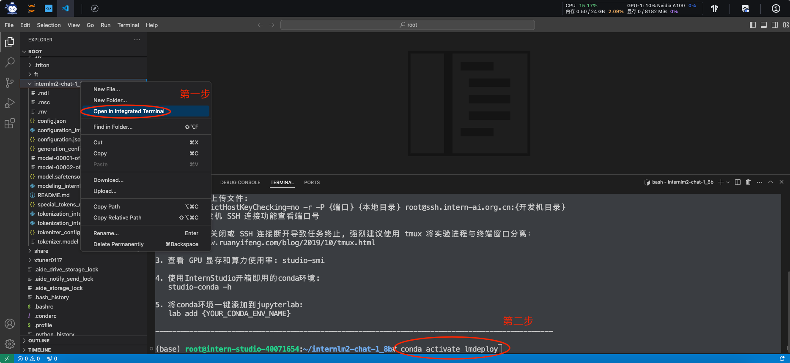
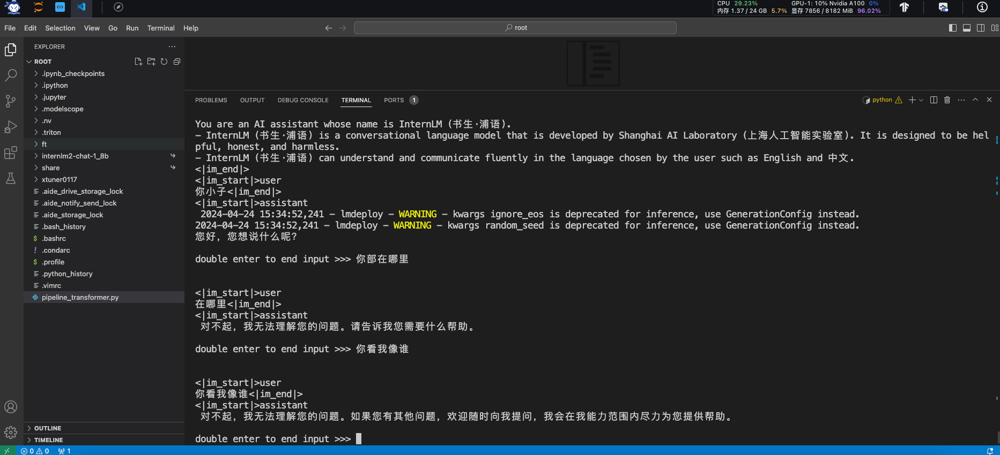
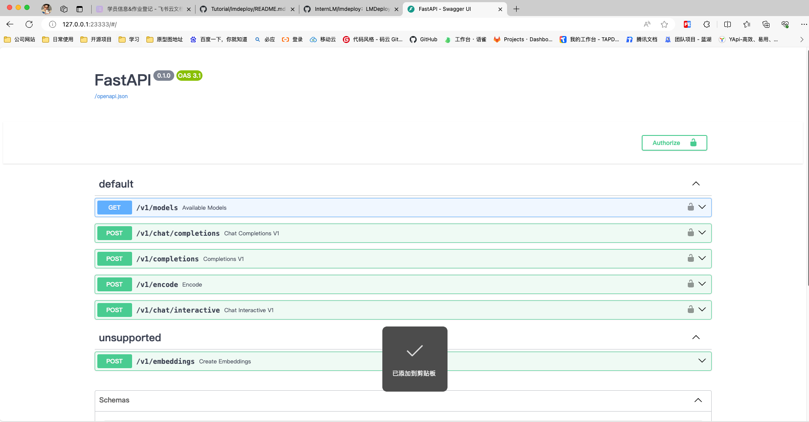
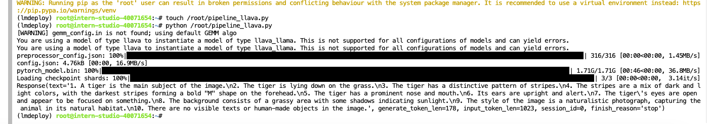
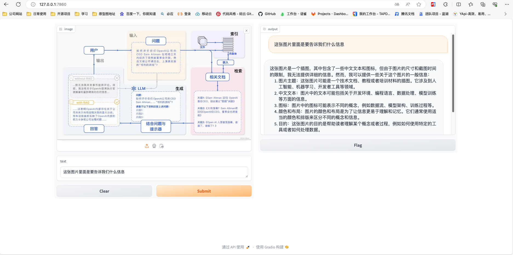

# LMDeploy 量化部署 LLM

[GitHub](https://github.com/InternLM/lmdeploy)
[教程](https://github.com/InternLM/Tutorial/blob/camp2/lmdeploy/README.md)

# 介绍 
LMDeploy 是一个用于压缩、部署、服务 LLM 的工具包，由 MMRazor 和 MMDeploy 团队开发。它具有以下核心功能：

- 高效推理引擎（TurboMind）：开发持久批处理（又称连续批处理）、阻塞KV缓存、动态拆分融合、张量并行、高性能CUDA内核等关键特性，确保LLM推理的高吞吐和低延迟。
- 交互式推理模式：通过在多轮对话过程中缓存注意力的k/v，引擎会记住对话历史，从而避免历史会话的重复处理。
- 量化：LMDeploy 支持多种量化方法和量化模型的高效推理。量化的可靠性已在不同尺度的模型上得到验证。

> 目前LMDeploy已经支持 Llama3 及更多 VLM，如 InternVL v1.1、v1.2、MiniGemini、InternLMXComposer2。

# 开发机准备
> 该教程需要注意镜像版本，官方推荐使用镜像`Cuda12.2-conda`，否则会出现兼容性问题。选择10% A100*1GPU；点击“立即创建”。

## 创建conda环境
** 注意该环境使用python版本为3.10，请勿使用其他python版本。安装过程中可能会由稍长时间，可以先大致阅读文档了解**
```shell
# 在studio开发机安装
studio-conda -t lmdeploy -o pytorch-2.1.2

# 在本地安装
conda create -n lmdeploy -y python=3.10
```
## 安装LMDeploy

```shell
# 激活刚才创建的conda环境
conda activate lmdeploy

# 安装0.3.0版本的lmdeploy，等待安装结束
 pip install lmdeploy[all]==0.3.0
```

# 模型对话
## Huggingface与TurboMind
### HuggingFace
[HuggingFace](https://huggingface.co/)是一个高速发展的社区，包括Meta、Google、Microsoft、Amazon在内的超过5000家组织机构在为HuggingFace开源社区贡献代码、数据集和模型。可以认为是一个针对深度学习模型和数据集的在线托管社区，如果你有数据集或者模型想对外分享，网盘又不太方便，就不妨托管在HuggingFace。

托管在HuggingFace社区的模型通常采用HuggingFace格式存储，简写为HF格式。

但是HuggingFace社区的服务器在国外，国内访问不太方便。国内可以使用阿里巴巴的[MindScope](https://www.modelscope.cn/home)社区，或者上海AI Lab搭建的[OpenXLab](https://openxlab.org.cn/home)社区，上面托管的模型也通常采用HF格式。

### TurboMind
TurboMind是LMDeploy团队开发的一款关于LLM推理的高效推理引擎，它的主要功能包括：LLaMa 结构模型的支持，continuous batch 推理模式和可扩展的 KV 缓存管理器。

TurboMind推理引擎仅支持推理TurboMind格式的模型。因此，TurboMind在推理HF格式的模型时，会首先自动将HF格式模型转换为TurboMind格式的模型。该过程在新版本的LMDeploy中是自动进行的，无需用户操作。

几个容易迷惑的点：

- TurboMind与LMDeploy的关系：LMDeploy是涵盖了LLM 任务全套轻量化、部署和服务解决方案的集成功能包，TurboMind是LMDeploy的一个推理引擎，是一个子模块。LMDeploy也可以使用pytorch作为推理引擎。
- TurboMind与TurboMind模型的关系：TurboMind是推理引擎的名字，TurboMind模型是一种模型存储格式，TurboMind引擎只能推理TurboMind格式的模型。

## 下载模型

### InternStudio开发机上下载模型（推荐）
> InternStudio开发机上已经内置了一些预训练模型，可以直接进行拷贝使用
```
# 进入根目录
cd ~
# 软连接
ln -s /root/share/new_models/Shanghai_AI_Laboratory/internlm2-chat-1_8b /root/
# 拷贝
# cp -r /root/share/new_models/Shanghai_AI_Laboratory/internlm2-chat-1_8b /root/
```

执行完上述步骤。即可在`root/`文件夹下查看模型，或如果是本地部署，可使用[MindScope](https://www.modelscope.cn/home)或者[OpenXLab](https://openxlab.org.cn/home)进行下载模型

### 这里演示由OpenXLab平台下载模型

```shell
git lfs install

# 下载模型
git clone https://code.openxlab.org.cn/OpenLMLab/internlm2-chat-1.8b.git

# 因从OpenXLab平台下载的模型文件夹命名为1.8b，而从InternStudio开发机直接拷贝的模型文件夹名称是1_8b，为了后续文档统一，这里统一命名为1_8b
mv /root/internlm2-chat-1.8b /root/internlm2-chat-1_8b
```

## 使用Transformer库运行模型
- 使用开发机用vscode打开刚才下载的1_8b模型，并且在命令行中激活刚才创建的`lmdeploy`conda环境，如下所示：



- 在`root`下新建`pipeline_transformer.py`文件，并且复制如下内容。
```shell
touch /root/pipeline_transformer.py
```
```shell
import torch
from transformers import AutoTokenizer, AutoModelForCausalLM

tokenizer = AutoTokenizer.from_pretrained("/root/internlm2-chat-1_8b", trust_remote_code=True)

# Set `torch_dtype=torch.float16` to load model in float16, otherwise it will be loaded as float32 and cause OOM Error.
model = AutoModelForCausalLM.from_pretrained("/root/internlm2-chat-1_8b", torch_dtype=torch.float16, trust_remote_code=True).cuda()
model = model.eval()

inp = "hello"
print("[INPUT]", inp)
response, history = model.chat(tokenizer, inp, history=[])
print("[OUTPUT]", response)

inp = "please provide three suggestions about time management"
print("[INPUT]", inp)
response, history = model.chat(tokenizer, inp, history=history)
print("[OUTPUT]", response)

```

- 运行`root/pipeline_transformer.py`代码
```shell
pip install transformers
pip install sentencepiece
python /root/pipeline_transformer.py

# 会出现 `No module named 'xx' `等如下错误，一直 `pip install xx` 安装对应模块，目前是缺少两个模块，已在上述命令中添加
(lmdeploy) root@intern-studio-40071654:~/internlm2-chat-1_8b# cd ..
(lmdeploy) root@intern-studio-40071654:~# python /root/pipeline_transformer.py
Traceback (most recent call last):
  File "/root/pipeline_transformer.py", line 2, in <module>
    from transformers import AutoTokenizer, AutoModelForCausalLM
ModuleNotFoundError: No module named 'transformers'
```
运行成功则会出现如下对话
```shell
(lmdeploy) root@intern-studio-40071654:~# python /root/pipeline_transformer.py
Loading checkpoint shards: 100%|██████████████████████████████████████████████████████████████████████████████████████| 2/2 [00:42<00:00, 21.44s/it]
[INPUT] hello
[OUTPUT] 你好，很高兴能够帮助你。有什么我可以帮助你的吗？
[INPUT] please provide three suggestions about time management
[OUTPUT] 当然，以下是一些关于时间管理的建议：

1. 制定清晰的目标和计划：在开始一天的工作之前，花一些时间制定清晰的目标和计划。这有助于你更好地了解自己需要完成的任务，并确保你在有限的时间内完成它们。

2. 使用时间管理工具：有许多应用程序和工具可以帮助你管理时间，例如日历、待办事项清单、提醒和闹钟等。这些工具可以帮助你跟踪任务，设置优先级，以及保持时间表的一致性。

3. 避免分散注意力：在处理任务时，避免分散注意力。将手机静音，关闭社交媒体和其他通知，以便专注于任务。此外，在处理任务时，尝试集中精力，避免被其他事情干扰。
(lmdeploy) root@intern-studio-40071654:~# 
```

## 使用LMDeploy与模型对话
> 确认已经进入conda环境，如没有请执行`conda activate lmdeploy`

- 使用LMDeploy运行下载的1.8B模型
```shell
lmdeploy chat /root/internlm2-chat-1_8b
```
> 使用LMdeploy运行时候结果发现lmdeploy用不了，发现原来是我没有执行`pip install lmdeploy[all]==0.3.0`，猜想上面使用transformers运行时候缺少module也是因为这个原因



- 如需查看LMDeploy更多参数可以通过-h命令查看
```shell
lmdeploy chat -h
```

# LMDeploy模型量化(lite)
> 量化是一种以参数或计算中间结果精度下降换空间节省（以及同时带来的性能提升）的策略。
- 计算密集（compute-bound）: 指推理过程中，绝大部分时间消耗在数值计算上；针对计算密集型场景，可以通过使用更快的硬件计算单元来提升计算速度。
- 访存密集（memory-bound）: 指推理过程中，绝大部分时间消耗在数据读取上；针对访存密集型场景，一般通过减少访存次数、提高计算访存比或降低访存量来优化。

常见的 LLM 模型由于 Decoder Only 架构的特性，实际推理时大多数的时间都消耗在了逐 Token 生成阶段（Decoding 阶段），是典型的访存密集型场景。

那么，如何优化 LLM 模型推理中的访存密集问题呢？ 我们可以使用KV8量化和W4A16量化。KV8量化是指将逐 Token（Decoding）生成过程中的上下文 K 和 V 中间结果进行 INT8 量化（计算时再反量化），以降低生成过程中的显存占用。W4A16 量化，将 FP16 的模型权重量化为 INT4，Kernel 计算时，访存量直接降为 FP16 模型的 1/4，大幅降低了访存成本。Weight Only 是指仅量化权重，数值计算依然采用 FP16（需要将 INT4 权重反量化）。

## 设置最大KV Cache缓存大小
KV Cache是一种缓存技术，通过存储键值对的形式来复用计算结果，以达到提高性能和降低内存消耗的目的。在大规模训练和推理中，KV Cache可以显著减少重复计算量，从而提升模型的推理速度。理想情况下，KV Cache全部存储于显存，以加快访存速度。当显存空间不足时，也可以将KV Cache放在内存，通过缓存管理器控制将当前需要使用的数据放入显存。

模型在运行时，占用的显存可大致分为三部分：模型参数本身占用的显存、KV Cache占用的显存，以及中间运算结果占用的显存。LMDeploy的KV Cache管理器可以通过设置`--cache-max-entry-count`参数，控制KV缓存占用剩余显存的最大比例。默认的比例为0.8。

```shell
lmdeploy chat /root/internlm2-chat-1_8b

# 显存占用为6608M
lmdeploy chat /root/internlm2-chat-1_8b --cache-max-entry-count 0.5

# 显存占用为4560MB，代价是会降低模型推理速度
lmdeploy chat /root/internlm2-chat-1_8b --cache-max-entry-count 0.01
```

## 使用W4A16量化
LMDeploy使用AWQ算法，实现模型4bit权重量化。推理引擎TurboMind提供了非常高效的4bit推理cuda kernel，性能是FP16的2.4倍以上。它支持以下NVIDIA显卡：

- 图灵架构（sm75）：20系列、T4
- 安培架构（sm80,sm86）：30系列、A10、A16、A30、A100
- Ada Lovelace架构（sm90）：40 系列

1. 安装依赖库
```shell
pip install einops==0.7.0
```
2. 执行模型量化
```shell
lmdeploy lite auto_awq \
   /root/internlm2-chat-1_8b \
  --calib-dataset 'ptb' \
  --calib-samples 128 \
  --calib-seqlen 1024 \
  --w-bits 4 \
  --w-group-size 128 \
  --work-dir /root/internlm2-chat-1_8b-4bit
```
3. 量化工作结束后，新的HF模型被保存到internlm2-chat-1_8b-4bit目录。下面使用Chat功能运行W4A16量化后的模型。
```shell
lmdeploy chat /root/internlm2-chat-1_8b-4bit --model-format awq
```
4. 调整KV Cache比例再次调用
```shell
lmdeploy chat /root/internlm2-chat-1_8b-4bit --model-format awq --cache-max-entry-count 0.01
```
5. LMDeploy的lite功能的更多参数可通过-h命令查
```shell
lmdeploy lite -h
```

# LMDeploy服务(serve)
> 该服务是我们在实际生产中尤为需要的，因为需要将大模型封装为API接口服务，供客户端访问，如ollama和langchain都提供api支持

该服务可以理解为三个层面：
- 模型推理/服务。主要提供模型本身的推理，一般来说可以和具体业务解耦，专注模型推理本身性能的优化。可以以模块、API等多种方式提供。
- API Server。中间协议层，把后端推理/服务通过HTTP，gRPC或其他形式的接口，供前端调用。
- Client。可以理解为前端，与用户交互的地方。通过通过网页端/命令行去调用API接口，获取模型推理/服务。

## 启动API服务器
```shell
#  启动API服务器，推理internlm2-chat-1_8b模型：
lmdeploy serve api_server \
    /root/internlm2-chat-1_8b \
    --model-format hf \
    --quant-policy 0 \
    --server-name 0.0.0.0 \
    --server-port 23333 \
    --tp 1
```
其中，model-format、quant-policy这些参数是与第三章中量化推理模型一致的；server-name和server-port表示API服务器的服务IP与服务端口；tp参数表示并行数量（GPU数量）。

- 通过以下命令可以查看更多参数及使用方法：
```shell
lmdeploy serve api_server -h
```
- 一如往常 因为是使用的开发机启动，所以想访问先需要本地连接开发机
```shell
ssh -CNg -L 23333:127.0.0.1:23333 root@ssh.intern-ai.org.cn -p 你的ssh端口号
```

- 连接完之后在浏览器中输入：`http://127.0.0.1:23333 ` 即可查看如下界面


- 同样你也可以使用命令行和Gradio作为客户端连接API服务器，具体可访问[传送门](https://github.com/InternLM/Tutorial/blob/camp2/lmdeploy/README.md#43-%E7%BD%91%E9%A1%B5%E5%AE%A2%E6%88%B7%E7%AB%AF%E8%BF%9E%E6%8E%A5api%E6%9C%8D%E5%8A%A1%E5%99%A8)


# Python代码集成
## Python代码集成运行1.8B模型
- 激活conda环境
```shell
conda activate lmdeploy
```
- 新建Python源代码文件pipeline.py
```shell
touch /root/pipeline.py
```
- 填入内容
```shell
from lmdeploy import pipeline

pipe = pipeline('/root/internlm2-chat-1_8b')
response = pipe(['Hi, pls intro yourself', '上海是'])
print(response)
```
> 代码解读：
>- 第1行，引入lmdeploy的pipeline模块 
>- 第3行，从目录“./internlm2-chat-1_8b”加载HF模型 
>- 第4行，运行pipeline，这里采用了批处理的方式，用一个列表包含两个输入，lmdeploy同时推理两个输入，产生两个输出结果，结果返回给response \
>- 第5行，输出response

- 运行代码
```shell
python /root/pipeline.py
```

## 向TurboMind后端传递参数
- 设置KV Cache占用比例为例，新建python文件pipeline_kv.p
```shell
touch /root/pipeline_kv.py
```

- 打开`pipeline_kv.py`，填入如下内容：
```shell
from lmdeploy import pipeline, TurbomindEngineConfig

# 调低 k/v cache内存占比调整为总显存的 20%
backend_config = TurbomindEngineConfig(cache_max_entry_count=0.2)

pipe = pipeline('/root/internlm2-chat-1_8b',
                backend_config=backend_config)
response = pipe(['Hi, pls intro yourself', '上海是'])
print(response)
```

- 运行代码
```shell
python /root/pipeline_kv.py
```

# 使用LMDeploy运行视觉多模态大模型llava（拓展）
> 在这一步我根据要求切换为30%的`InternStudio`开发机

- 激活conda环境
```shell
conda activate lmdeploy
```
- 安装llava依赖库。
```shell
pip install git+https://github.com/haotian-liu/LLaVA.git@4e2277a060da264c4f21b364c867cc622c945874
```

## 使用命令行运行
- 新建一个python文件，比如`pipeline_llava.py`。
```shell
touch /root/pipeline_llava.py
```

- 打开pipeline_llava.py，填入内容如下： 该内容是使用llava模型进行图片描述的代码。
```shell
from lmdeploy.vl import load_image
from lmdeploy import pipeline, TurbomindEngineConfig


backend_config = TurbomindEngineConfig(session_len=8192) # 图片分辨率较高时请调高session_len
# pipe = pipeline('liuhaotian/llava-v1.6-vicuna-7b', backend_config=backend_config) 非开发机运行此命令
pipe = pipeline('/share/new_models/liuhaotian/llava-v1.6-vicuna-7b', backend_config=backend_config)

image = load_image('https://raw.githubusercontent.com/open-mmlab/mmdeploy/main/tests/data/tiger.jpeg')
response = pipe(('describe this image', image))
print(response)
```

- 运行pipeline。
```shell
python /root/pipeline_llava.py
```

- 运行结果如下：



## 使用Gradio运行llava模型

- 新建python文件gradio_llava.py。
```shell
touch /root/gradio_llava.py
```

- 填入内容
```shell
import gradio as gr
from lmdeploy import pipeline, TurbomindEngineConfig


backend_config = TurbomindEngineConfig(session_len=8192) # 图片分辨率较高时请调高session_len
# pipe = pipeline('liuhaotian/llava-v1.6-vicuna-7b', backend_config=backend_config) 非开发机运行此命令
pipe = pipeline('/share/new_models/liuhaotian/llava-v1.6-vicuna-7b', backend_config=backend_config)

def model(image, text):
    if image is None:
        return [(text, "请上传一张图片。")]
    else:
        response = pipe((text, image)).text
        return [(text, response)]

demo = gr.Interface(fn=model, inputs=[gr.Image(type="pil"), gr.Textbox()], outputs=gr.Chatbot())
demo.launch()   
```
- 运行python程序
```shell
python /root/gradio_llava.py
```

- 通过ssh转发7860端口到本机
```shell
ssh -CNg -L 7860:127.0.0.1:7860 root@ssh.intern-ai.org.cn -p <你的ssh端口>
```

- 通过浏览器访问`http://127.0.0.1:7860`，结果如下：


# 总结

