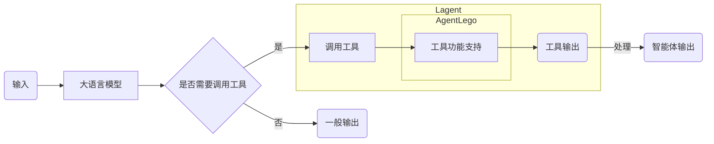
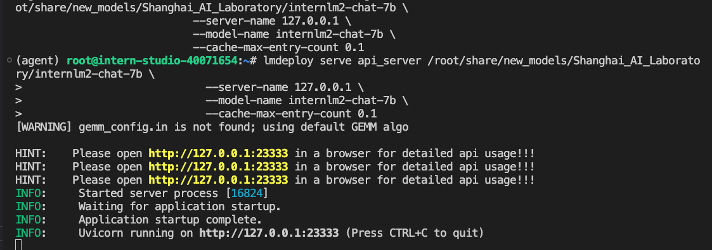
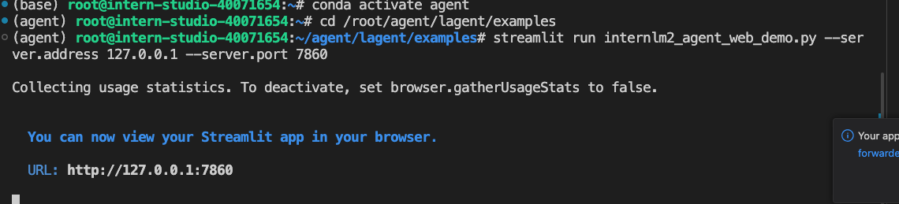
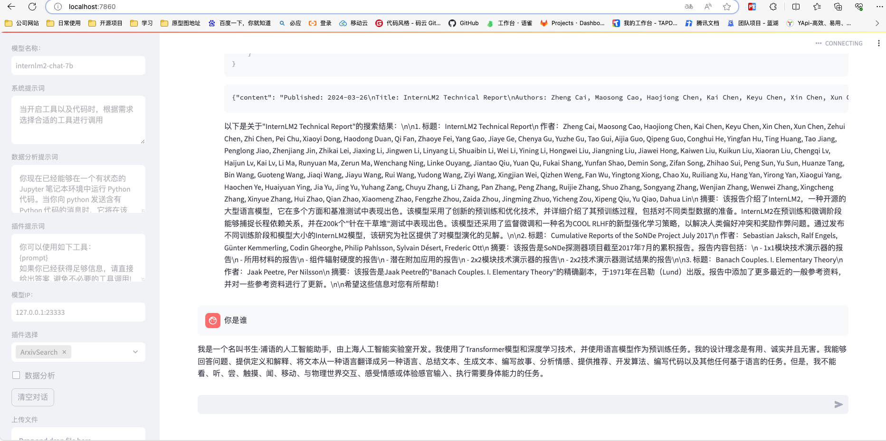
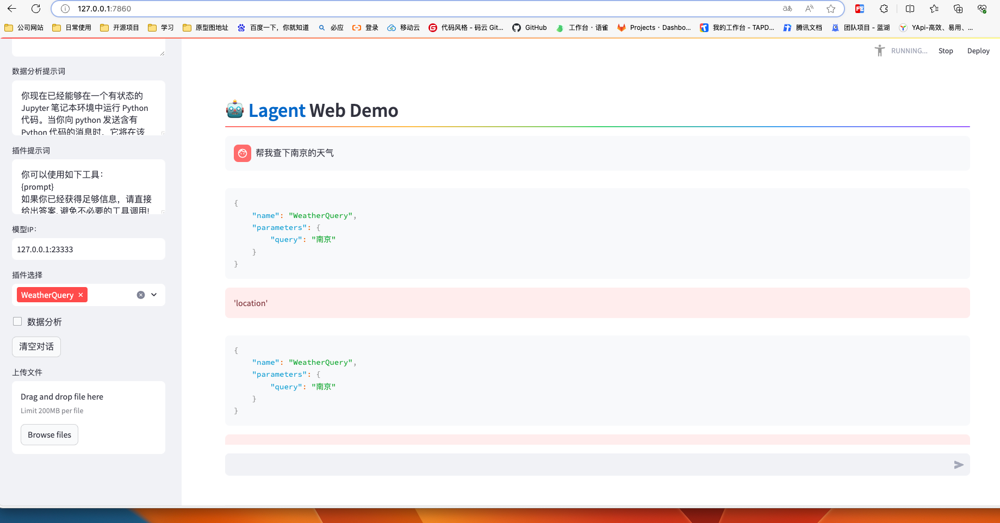
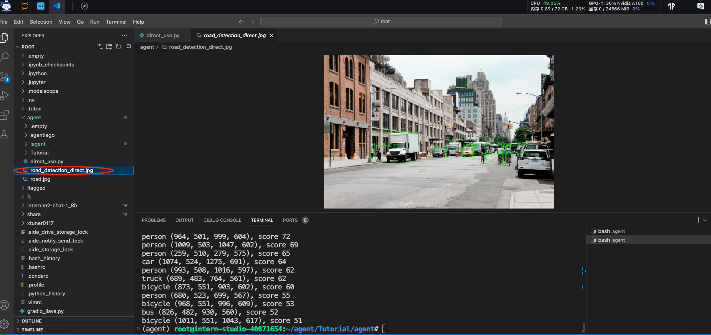
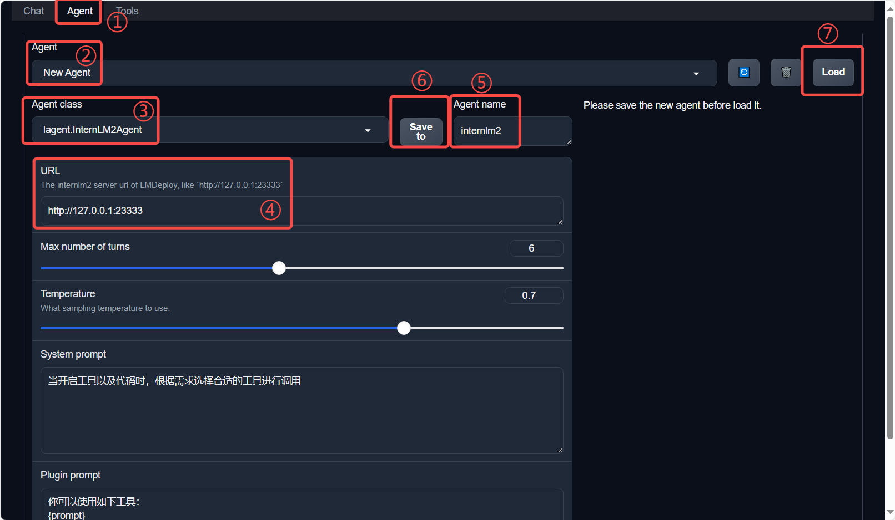
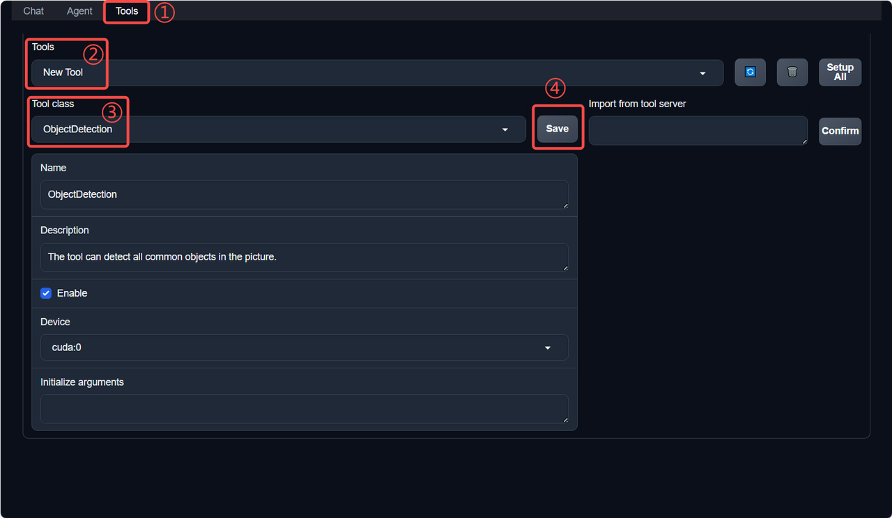
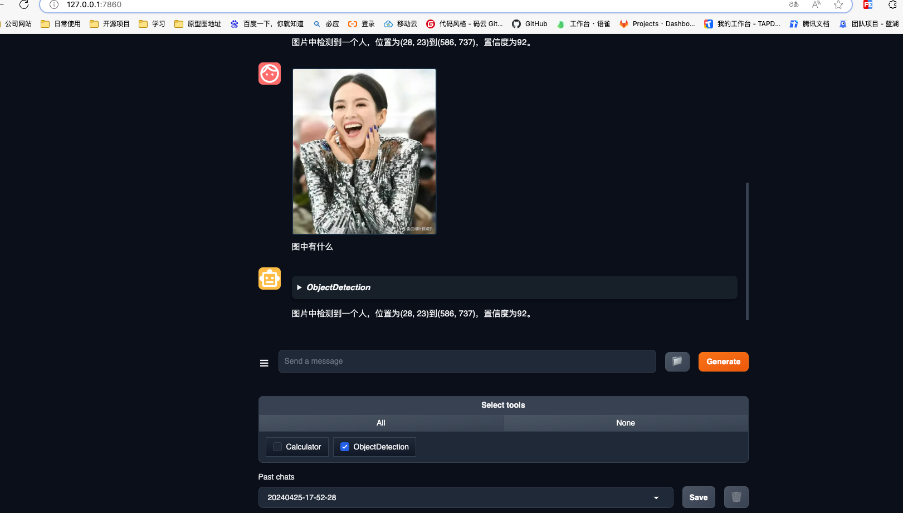
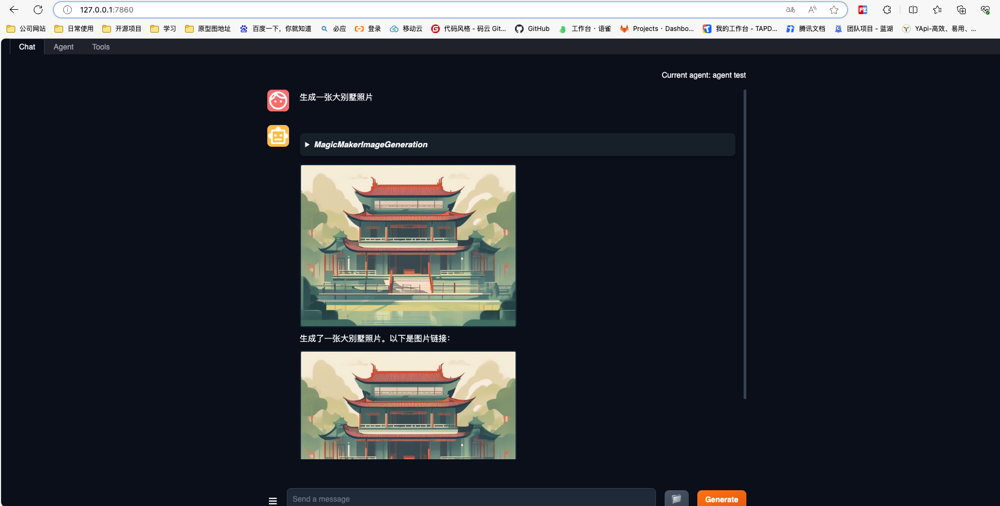

# Lagent & AgentLego 智能体应用搭建

[Lagent项目地址](https://github.com/InternLM/Lagent)

[AgentLego项目地址](https://github.com/InternLM/AgentLego)

[教程](https://github.com/InternLM/Tutorial/tree/camp2/agent)

# 介绍 

## Lagent 是什么
Lagent 是一个轻量级开源智能体框架，旨在让用户可以高效地构建基于大语言模型的智能体。同时它也提供了一些典型工具以增强大语言模型的能力。

Lagent 目前已经支持了包括 AutoGPT、ReAct 等在内的多个经典智能体范式，也支持了如下工具：

- Arxiv 搜索
- Bing 地图
- Google 学术搜索
- Google 搜索
- 交互式 IPython 解释器
- IPython 解释器
- PPT
- Python 解释器

## AgentLego 是什么
AgentLego 是一个提供了多种开源工具 API 的多模态工具包，可以让用户可以快速简便地拓展自定义工具，从而组装出自己的智能体。通过 AgentLego 算法库，不仅可以直接使用多种工具，也可以利用这些工具，在相关智能体框架（如 Lagent，Transformers Agent 等）的帮助下，快速构建可以增强大语言模型能力的智能体。

- 通用能力
  - 计算器
  - 谷歌搜索
- 语音相关
  - 文本 -> 音频（TTS）
  - 音频 -> 文本（STT）
- 图像处理
  - 描述输入图像
  - 识别文本（OCR）
  - 视觉问答（VQA
  - 深度图生成
  - 人脸关键点检测
  - 检测目标
  - 。。。
- AIGC
  - 文生图
  - 图像拓展
  - 根据指令修改
  - 等等

## 两者之间的关系
Lagent 是一个轻量级的智能体框架，而 AgentLego 则是一个多模态工具包，二者可以结合使用，从而构建出更加强大的智能体。



# 开发机准备
> 该教程需要注意镜像版本，官方推荐使用镜像`Cuda12.2-conda`，否则会出现兼容性问题。选择30% A100*1GPU；点击“立即创建”。

## 创建conda环境
** 注意该环境使用pytorch版本为2.12，请勿使用其他版本。安装过程中可能会由稍长时间，可以先大致阅读文档了解**
```shell
# 在studio开发机安装
studio-conda -t agent -o pytorch-2.1.2

# 在本地安装
conda create -n agent
conda activate agent
conda install python=3.10
conda install pytorch==2.1.2 torchvision==0.16.2 torchaudio==2.1.2 pytorch-cuda=11.8 -c pytorch -c nvidia
```

## 安装 Lagent 和 AgentLego
Lagent 和 AgentLego 都提供了两种安装方法，一种是通过 pip 直接进行安装，另一种则是从源码进行安装。为了方便使用 Lagent 的 Web Demo 以及 AgentLego 的 WebUI，教程选择直接从源码进行安装。 

此处附上源码安装的相关帮助文档
- Lagent：https://lagent.readthedocs.io/zh-cn/latest/get_started/install.html
- AgentLego：https://agentlego.readthedocs.io/zh-cn/latest/get_started.html

### 执行一下命令安装
```shell
cd /root/agent
# 激活agent环境
conda activate agent
# 拉取lagent项目
git clone https://gitee.com/internlm/lagent.git
cd lagent && git checkout 581d9fb && pip install -e . && cd ..
# 拉取agentlego项目
git clone https://gitee.com/internlm/agentlego.git
cd agentlego && git checkout 7769e0d && pip install -e . && cd ..
```

### 安装其他依赖
> 这里需要安装前文教程中的LMDeploy，LMDeploy 是一个用于压缩、部署、服务 LLM 的工具包。
```shell
conda activate agent
# 安装LMDeploy
pip install lmdeploy==0.3.0
```

### 准备 Tutorial 
> 因后续教程中需要用到 tutorial 已经写好的脚本，因此我们需要将 tutorial 通过 git clone 的方法准备好，以备后续使用
> 该项目也为Internlm的开源项目，里面提供demo
```shell
cd /root/agent
git clone -b camp2 https://gitee.com/internlm/Tutorial.git
```

# Lagent：轻量级智能体框架
> 使用 Lagent 自定义工具，并体验自定义工具的效果：[Lagent：轻量级智能体框架](https://github.com/InternLM/Tutorial/blob/camp2/agent/lagent.md)

## Lagent Web Demo

### 使用 LMDeploy 部署
```shell
conda activate agent
# 官方教程里面没有指定端口号，一直启动不了，后来加了之后启动了，后来发现应该还是环境问题，重新装了一遍之后不加端口号 也可以启动
lmdeploy serve api_server /root/share/new_models/Shanghai_AI_Laboratory/internlm2-chat-7b --server-name 127.0.0.1 --server-port 23333 --model-name internlm2-chat-7b --cache-max-entry-count 0.1
```
- 启动好后效果：


### 启动并使用 Lagent Web Demo
```shell
# 重新打开一个终端
conda activate agent
cd /root/agent/lagent/examples
streamlit run internlm2_agent_web_demo.py --server.address 127.0.0.1 --server.port 7860
```
- 启动好后效果：


### 将端口映射到本地执行
```shell
ssh -CNg -L 7860:127.0.0.1:7860 -L 23333:127.0.0.1:23333 root@ssh.intern-ai.org.cn -p <你的 开发机ssh 端口号>
```

### 演示效果


## 用 Lagent 自定义工具
> `Lagent`工具介绍： https://lagent.readthedocs.io/zh-cn/latest/tutorials/action.html
- 继承 BaseAction 类
- 实现简单工具的 run 方法；或者实现工具包内每个子工具的功能
- 简单工具的 run 方法可选被 tool_api 装饰；工具包内每个子工具的功能都需要被 tool_api 装饰

## 创建工具文件（调用天气api工具）
- 新建工具文件`touch /root/agent/lagent/lagent/actions/weather.py`，内容如下：
```shell
import json
import os
import requests
from typing import Optional, Type

from lagent.actions.base_action import BaseAction, tool_api
from lagent.actions.parser import BaseParser, JsonParser
from lagent.schema import ActionReturn, ActionStatusCode

class WeatherQuery(BaseAction):
    """Weather plugin for querying weather information."""
    
    def __init__(self,
                 key: Optional[str] = None,
                 description: Optional[dict] = None,
                 parser: Type[BaseParser] = JsonParser,
                 enable: bool = True) -> None:
        super().__init__(description, parser, enable)
        key = os.environ.get('WEATHER_API_KEY', key)
        if key is None:
            raise ValueError(
                'Please set Weather API key either in the environment '
                'as WEATHER_API_KEY or pass it as `key`')
        self.key = key
        self.location_query_url = 'https://geoapi.qweather.com/v2/city/lookup'
        self.weather_query_url = 'https://devapi.qweather.com/v7/weather/now'

    @tool_api
    def run(self, query: str) -> ActionReturn:
        """一个天气查询API。可以根据城市名查询天气信息。
        
        Args:
            query (:class:`str`): The city name to query.
        """
        tool_return = ActionReturn(type=self.name)
        status_code, response = self._search(query)
        if status_code == -1:
            tool_return.errmsg = response
            tool_return.state = ActionStatusCode.HTTP_ERROR
        elif status_code == 200:
            parsed_res = self._parse_results(response)
            tool_return.result = [dict(type='text', content=str(parsed_res))]
            tool_return.state = ActionStatusCode.SUCCESS
        else:
            tool_return.errmsg = str(status_code)
            tool_return.state = ActionStatusCode.API_ERROR
        return tool_return
    
    def _parse_results(self, results: dict) -> str:
        """Parse the weather results from QWeather API.
        
        Args:
            results (dict): The weather content from QWeather API
                in json format.
        
        Returns:
            str: The parsed weather results.
        """
        now = results['now']
        data = [
            f'数据观测时间: {now["obsTime"]}',
            f'温度: {now["temp"]}°C',
            f'体感温度: {now["feelsLike"]}°C',
            f'天气: {now["text"]}',
            f'风向: {now["windDir"]}，角度为 {now["wind360"]}°',
            f'风力等级: {now["windScale"]}，风速为 {now["windSpeed"]} km/h',
            f'相对湿度: {now["humidity"]}',
            f'当前小时累计降水量: {now["precip"]} mm',
            f'大气压强: {now["pressure"]} 百帕',
            f'能见度: {now["vis"]} km',
        ]
        return '\n'.join(data)

    def _search(self, query: str):
        # get city_code
        try:
            city_code_response = requests.get(
                self.location_query_url,
                params={'key': self.key, 'location': query}
            )
        except Exception as e:
            return -1, str(e)
        if city_code_response.status_code != 200:
            return city_code_response.status_code, city_code_response.json()
        city_code_response = city_code_response.json()
        if len(city_code_response['location']) == 0:
            return -1, '未查询到城市'
        city_code = city_code_response['location'][0]['id']
        # get weather
        try:
            weather_response = requests.get(
                self.weather_query_url,
                params={'key': self.key, 'location': city_code}
            )
        except Exception as e:
            return -1, str(e)
        return weather_response.status_code, weather_response.json()
```
- 获取和风天气API KEY，获取地址：https://dev.qweather.com/docs/api/
- 体验自定义工具效果
- 重启使用LMdeploy启动api服务和web demo，参考上：使用 LMDeploy 部署
```shell
conda activate agent
# 官方教程里面没有指定端口号，一直启动不了，后来加了之后启动了
lmdeploy serve api_server /root/share/new_models/Shanghai_AI_Laboratory/internlm2-chat-7b --server-name 127.0.0.1 --server-port 23333 --model-name internlm2-chat-7b --cache-max-entry-count 0.1
# 注意这里 切换个终端
# 比如 export WEATHER_API_KEY=1234567890abcdef
export WEATHER_API_KEY=上节获取的和风天气API KEY
conda activate agent
cd /root/agent/Tutorial/agent
streamlit run internlm2_weather_web_demo.py --server.address 127.0.0.1 --server.port 7860
```
- 执行端口映射
```shell
ssh -CNg -L 7860:127.0.0.1:7860 -L 23333:127.0.0.1:23333 root@ssh.intern-ai.org.cn -p <你的 开发机ssh 端口号>
```

### 浏览器数据`127.0.0.1:7860`查看演示效果，因没有配置天气的key，所以没能正确输出


# AgentLego：组装智能体“乐高”
体验 AgentLego 的 WebUI：[AgentLego：组装智能体“乐高”](https://github.com/InternLM/Tutorial/blob/camp2/agent/agentlego.md)
- 直接使用 AgentLego
- 作为智能体工具使用
- 用AgentLego自定义工具

## 直接使用 AgentLego
> 以目标检测工具为例

- 首先下载 demo 文件：
```shell
cd /root/agent
wget http://download.openmmlab.com/agentlego/road.jpg
```
出现如下进度条
```shell
--2024-04-25 17:21:31--  http://download.openmmlab.com/agentlego/road.jpg
Resolving proxy.intern-ai.org.cn (proxy.intern-ai.org.cn)... 172.18.128.194
Connecting to proxy.intern-ai.org.cn (proxy.intern-ai.org.cn)|172.18.128.194|:50000... connected.
Proxy request sent, awaiting response... 200 OK
Length: 284676 (278K) [image/jpeg]
Saving to: 'road.jpg'

road.jpg                   100%[========================================>] 278.00K  --.-KB/s    in 0s      

2024-04-25 17:21:31 (555 MB/s) - 'road.jpg' saved [284676/284676]
```

- 安装依赖
> AgentLego 所实现的目标检测工具是基于 mmdet (MMDetection) 算法库中的 RTMDet-Large 模型，所以需安装min
```shell
conda activate agent
pip install openmim==0.3.9
mim install mmdet==3.3.0
```

- 在`/root/agent` 目录下新建 direct_use.py 以直接使用目标检测工具：`touch /root/agent/direct_use.py`
```shell
import re

import cv2
from agentlego.apis import load_tool

# load tool
tool = load_tool('ObjectDetection', device='cuda')

# apply tool
visualization = tool('/root/agent/road.jpg')
print(visualization)

# visualize
image = cv2.imread('/root/agent/road.jpg')

preds = visualization.split('\n')
pattern = r'(\w+) \((\d+), (\d+), (\d+), (\d+)\), score (\d+)'

for pred in preds:
    name, x1, y1, x2, y2, score = re.match(pattern, pred).groups()
    x1, y1, x2, y2, score = int(x1), int(y1), int(x2), int(y2), int(score)
    cv2.rectangle(image, (x1, y1), (x2, y2), (0, 255, 0), 1)
    cv2.putText(image, f'{name} {score}', (x1, y1), cv2.FONT_HERSHEY_SIMPLEX, 0.8, (0, 255, 0), 1)

cv2.imwrite('/root/agent/road_detection_direct.jpg', image)
```
- 运行代码进行推理
```shell
python /root/agent/direct_use.py
```
> 运行完之后可以在`/root/agent`下看到一张名为 road_detection_direct.jpg



## 作为智能体工具使用
### 修改配置文件
- 由于 AgentLego 算法库默认使用 InternLM2-Chat-20B 模型，因此我们首先需要修改 `/root/agent/agentlego/webui/modules/agents/lagent_agent.py` 文件的第 105行位置，将 internlm2-chat-20b 修改为 internlm2-chat-7b，
```shell
def llm_internlm2_lmdeploy(cfg):
    url = cfg['url'].strip()
    llm = LMDeployClient(
-         model_name='internlm2-chat-20b',
+         model_name='internlm2-chat-7b',
        url=url,
        meta_template=INTERNLM2_META,
        top_p=0.8,
        top_k=100,
        temperature=cfg.get('temperature', 0.7),
        repetition_penalty=1.0,
        stop_words=['<|im_end|>'])
    return llm
```
### 使用 LMDeploy 部署
```shell
conda activate agent
lmdeploy serve api_server /root/share/new_models/Shanghai_AI_Laboratory/internlm2-chat-7b \
                            --server-name 127.0.0.1 \
                            --model-name internlm2-chat-7b \
                            --cache-max-entry-count 0.1
```

### 启动 AgentLego WebUI
```shell
conda activate agent
cd /root/agent/agentlego/webui
python one_click.py
```

### 映射到本地端口
```shell
ssh -CNg -L 7860:127.0.0.1:7860 -L 23333:127.0.0.1:23333 root@ssh.intern-ai.org.cn -p <你的 ssh 端口号>
```

### 打开 `http://localhost:7860` 使用AgentLego WebUI
> 按照如图中所示点击
- 点击上方 Agent 进入 Agent 配置页面。（如①所示）
- 点击 Agent 下方框，选择 New Agent。（如②所示）
- 选择 Agent Class 为 lagent.InternLM2Agent。（如③所示）
- 输入模型 URL 为 http://127.0.0.1:23333 。（如④所示）
- 输入 Agent name，自定义即可，图中输入了 internlm2。（如⑤所示）
- 点击 save to 以保存配置，这样在下次使用时只需在第2步时选择 Agent 为 internlm2 后点击 load 以加载就可以了。（如⑥所示）
- 点击 load 以加载配置。（如⑦所示）


然后配置工具：
- 点击上方 Tools 页面进入工具配置页面。（如①所示）
- 点击 Tools 下方框，选择 New Tool 以加载新工具。（如②所示）
- 选择 Tool Class 为 ObjectDetection。（如③所示）
- 点击 save 以保存配置。（如④所示）


### 上传图片使用AgentLego，开始检测图片中信息



## 用 AgentLego 自定义工具
> 以图像生成MagicMaker工具为例，详细文档地址为[这里](https://agentlego.readthedocs.io/zh-cn/latest/modules/tool.html)

自定义工具主要分为以下几步：
- 继承 BaseTool 类
- 修改 default_desc 属性（工具功能描述）
- 如有需要，重载 setup 方法（重型模块延迟加载）
- 重载 apply 方法（工具功能实现）

> MagicMaker 是汇聚了优秀 AI 算法成果的免费 AI 视觉素材生成与创作平台。主要提供图像生成、图像编辑和视频生成三大核心功能，全面满足用户在各种应用场景下的视觉素材创作需求。体验更多功能可以[访问](https://magicmaker.openxlab.org.cn/home) 。

### 创建工具文件
- 首先通过 `touch /root/agent/agentlego/agentlego/tools/magicmaker_image_generation.py`（大小写敏感）的方法新建工具文件。该文件的内容如下：
```shell
import json
import requests

import numpy as np

from agentlego.types import Annotated, ImageIO, Info
from agentlego.utils import require
from .base import BaseTool


class MagicMakerImageGeneration(BaseTool):

    default_desc = ('This tool can call the api of magicmaker to '
                    'generate an image according to the given keywords.')

    styles_option = [
        'dongman',  # 动漫
        'guofeng',  # 国风
        'xieshi',   # 写实
        'youhua',   # 油画
        'manghe',   # 盲盒
    ]
    aspect_ratio_options = [
        '16:9', '4:3', '3:2', '1:1',
        '2:3', '3:4', '9:16'
    ]

    @require('opencv-python')
    def __init__(self,
                 style='guofeng',
                 aspect_ratio='4:3'):
        super().__init__()
        if style in self.styles_option:
            self.style = style
        else:
            raise ValueError(f'The style must be one of {self.styles_option}')
        
        if aspect_ratio in self.aspect_ratio_options:
            self.aspect_ratio = aspect_ratio
        else:
            raise ValueError(f'The aspect ratio must be one of {aspect_ratio}')

    def apply(self,
              keywords: Annotated[str,
                                  Info('A series of Chinese keywords separated by comma.')]
        ) -> ImageIO:
        import cv2
        response = requests.post(
            url='https://magicmaker.openxlab.org.cn/gw/edit-anything/api/v1/bff/sd/generate',
            data=json.dumps({
                "official": True,
                "prompt": keywords,
                "style": self.style,
                "poseT": False,
                "aspectRatio": self.aspect_ratio
            }),
            headers={'content-type': 'application/json'}
        )
        image_url = response.json()['data']['imgUrl']
        image_response = requests.get(image_url)
        image = cv2.cvtColor(cv2.imdecode(np.frombuffer(image_response.content, np.uint8), cv2.IMREAD_COLOR),cv2.COLOR_BGR2RGB)
        return ImageIO(image)
```
### 注册新工具
接下来修改 /root/agent/agentlego/agentlego/tools/__init__.py 文件，将我们的工具注册在工具列表中。如下所示，我们将 MagicMakerImageGeneration 通过 from .magicmaker_image_generation import MagicMakerImageGeneration 导入到了文件中，并且将其加入了 __all__ 列表中。

```shell
from .base import BaseTool
from .calculator import Calculator
from .func import make_tool
from .image_canny import CannyTextToImage, ImageToCanny
from .image_depth import DepthTextToImage, ImageToDepth
from .image_editing import ImageExpansion, ImageStylization, ObjectRemove, ObjectReplace
from .image_pose import HumanBodyPose, HumanFaceLandmark, PoseToImage
from .image_scribble import ImageToScribble, ScribbleTextToImage
from .image_text import ImageDescription, TextToImage
from .imagebind import AudioImageToImage, AudioTextToImage, AudioToImage, ThermalToImage
from .object_detection import ObjectDetection, TextToBbox
from .ocr import OCR
from .scholar import *  # noqa: F401, F403
from .search import BingSearch, GoogleSearch
from .segmentation import SegmentAnything, SegmentObject, SemanticSegmentation
from .speech_text import SpeechToText, TextToSpeech
from .translation import Translation
from .vqa import VQA
+ from .magicmaker_image_generation import MagicMakerImageGeneration

__all__ = [
    'CannyTextToImage', 'ImageToCanny', 'DepthTextToImage', 'ImageToDepth',
    'ImageExpansion', 'ObjectRemove', 'ObjectReplace', 'HumanFaceLandmark',
    'HumanBodyPose', 'PoseToImage', 'ImageToScribble', 'ScribbleTextToImage',
    'ImageDescription', 'TextToImage', 'VQA', 'ObjectDetection', 'TextToBbox', 'OCR',
    'SegmentObject', 'SegmentAnything', 'SemanticSegmentation', 'ImageStylization',
    'AudioToImage', 'ThermalToImage', 'AudioImageToImage', 'AudioTextToImage',
    'SpeechToText', 'TextToSpeech', 'Translation', 'GoogleSearch', 'Calculator',
-     'BaseTool', 'make_tool', 'BingSearch'
+     'BaseTool', 'make_tool', 'BingSearch', 'MagicMakerImageGeneration'
]
```

### 使用LMDeploy部署API服务和运行AgentLego Web UI

```shell
conda activate agent
lmdeploy serve api_server /root/share/new_models/Shanghai_AI_Laboratory/internlm2-chat-7b \
                            --server-name 127.0.0.1 \
                            --model-name internlm2-chat-7b \
                            --cache-max-entry-count 0.1
```
- 切换新端口 启动`Agentleg Web UI`
```shell
conda activate agent
cd /root/agent/agentlego/webui
python one_click.py
```
### 本地端口映射开发机
```shell
ssh -CNg -L 7860:127.0.0.1:7860 -L 23333:127.0.0.1:23333 root@ssh.intern-ai.org.cn -p <你的 ssh 端口号>
```

### 本地浏览器打开`127.0.0.1:7860` 进行访问，注意在这边需要重新选择agent，否则会提示未加载agent
- 在 Tool 界面选择 MagicMakerImageGeneration 后点击 save 后，回到 Chat 页面选择 MagicMakerImageGeneration，然后开始问答


# Agent 工具能力微调
介绍 OpenAI Function Calling 的相关内容，以及带大家使用 XTuner 来实现 Agent 工具能力的微调
[Agent 工具能力微调](https://github.com/InternLM/Tutorial/blob/camp2/agent/finetune.md)