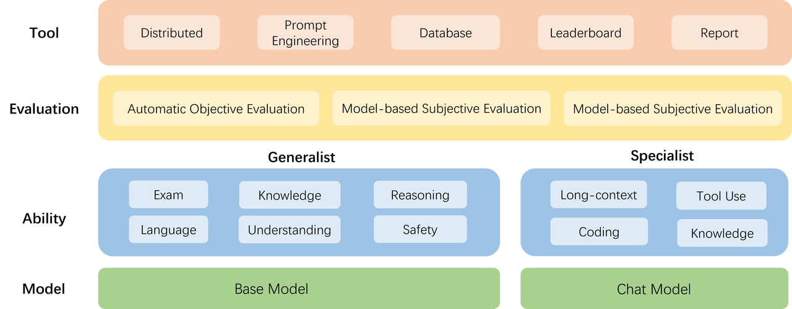
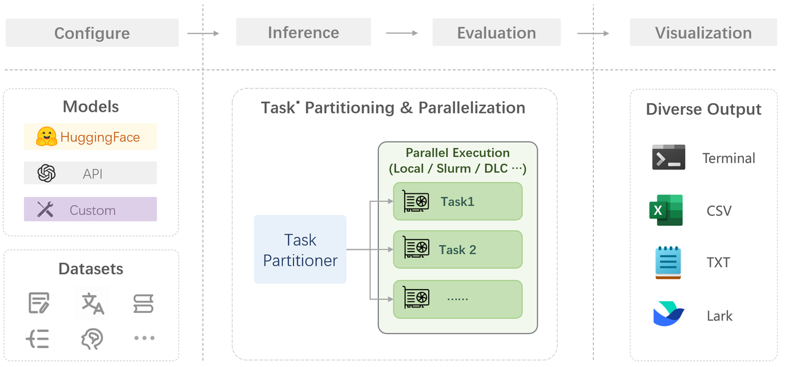
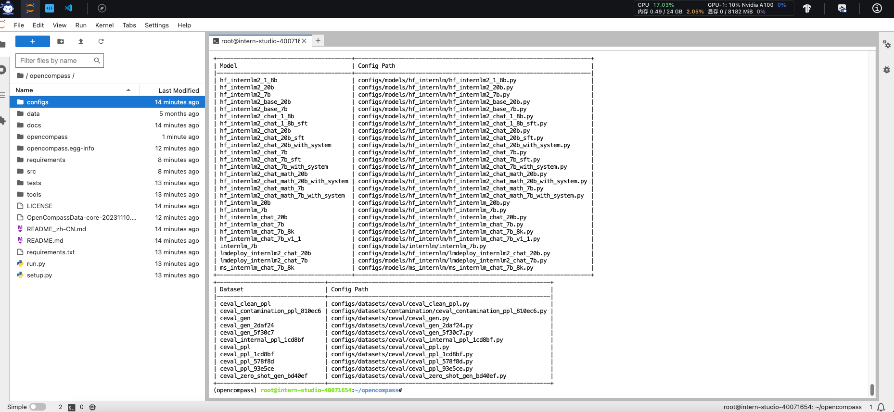
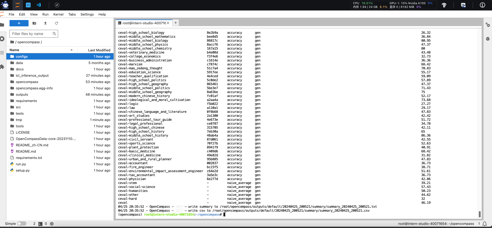

# OpenCompass大模型评测 （看看谁更强）

[项目地址](https://github.com/open-compass/opencompass)
[文档地址](https://opencompass.readthedocs.io/zh-cn/latest)

[教程](https://github.com/InternLM/Tutorial/blob/camp2/opencompass/readme.md)


# 前言
- 为什么需要大模型的评测？
1. 研究评测对全面了解大型语言模型的优势和限制至关重要，这有助于判断模型能力是否基于真正的理解，而非仅对训练数据的记忆。
2. 评测有助于指导和改进人类与大型语言模型之间的协同交互，从而设计更好的人机交互范式。
3. 科学的评测机制能够评估大型语言模型的能力，预测潜在风险，为未来发展提供重要参考。
4. 尽管训练大型语言模型成本高昂，但了解其性能、舒适性和安全性对于选择适合的模型至关重要，对研究人员和产品开发者具有实际意义。

# 介绍
OpenCompass 是上海人工智能实验室科学家团队开源的司南” (OpenCompass2.0)的大模型（LLM）评测工具，用于为大语言模型、多模态模型提供一站式的评测服务。

- 开源可复现：提供公平、公开、可复现的大模型评测方案
- 丰富的模型支持：已支持 20+ HuggingFace 及 API 模型
- 分布式高效评测：一行命令实现任务分割和分布式评测，数小时即可完成千亿模型全量评测
- 全面的能力维度：五大维度设计，提供 70+ 个数据集约 40 万题的的模型评测方案，全面评估模型能力
- 多样化评测范式：支持零样本、小样本及思维链评测，结合标准型或对话型提示词模板，轻松激发各种模型最大性能
- 灵活化拓展：想增加新模型或数据集？想要自定义更高级的任务分割策略，甚至接入新的集群管理系统？OpenCompass 的一切均可轻松扩展！

# 评测对象
> `OpenCompass`的主要评测对象为语言模型与多模态模型。本教程主要以大语言模型介绍评测的具体模型类型
- 基座模型：一般是经过海量的文本数据以自监督学习的方式进行训练获得的模型（如OpenAI的GPT-3，Meta的LLaMA），往往具有强大的文字续写能力。
- 对话模型：一般是在的基座模型的基础上，经过指令微调或人类偏好对齐获得的模型（如OpenAI的ChatGPT、上海人工智能实验室的书生·浦语），能理解人类指令，具有较强的对话能力。

# 工具架构

- 模型层：大模型评测所涉及的主要模型种类，OpenCompass 以基座模型和对话模型作为重点评测对象。
- 能力层：OpenCompass 从本方案从通用能力和特色能力两个方面来进行评测维度设计。在模型通用能力方面，从语言、知识、理解、推理、安全等多个能力维度进行评测。在特色能力方面，从长文本、代码、工具、知识增强等维度进行评测。
- 方法层：OpenCompass 采用客观评测与主观评测两种评测方式。客观评测能便捷地评估模型在具有确定答案（如选择，填空，封闭式问答等）的任务上的能力，主观评测能评估用户对模型回复的真实满意度，OpenCompass 采用基于模型辅助的主观评测和基于人类反馈的主观评测两种方式。
- 工具层：OpenCompass 提供丰富的功能支持自动化地开展大语言模型的高效评测。包括分布式评测技术，提示词工程，对接评测数据库，评测榜单发布，评测报告生成等诸多功能。

# 评测方法
## 主观评测

1. 语言表达和能力的多样性难以通过客观指标完全评测。
2. 主观评测更能体现大语言模型在实际使用场景中的真实能力。
3. OpenCompass采用主观评测方案，通过受试者判断模型对话能力。
4. 评测方法包括构建主观测试问题集，展示不同模型回复并收集评分。
5. 为降低成本，也采用大语言模型模拟人类进行主观打分。
6. 结合真实人类专家和模型打分的主观评测，全面评估模型能力。
7. 具体评测工作包括单模型回复满意度统计和多模型满意度比较。

## 客观评测
- 判别式评测：该评测方式基于将问题与候选答案组合在一起，计算模型在所有组合上的困惑度（perplexity），并选择困惑度最小的答案作为模型的最终输出。例如，若模型在 问题? 答案1 上的困惑度为 0.1，在 问题? 答案2 上的困惑度为 0.2，最终我们会选择 答案1 作为模型的输出。
- 生成式评测：该评测方式主要用于生成类任务，如语言翻译、程序生成、逻辑分析题等。具体实践时，使用问题作为模型的原始输入，并留白答案区域待模型进行后续补全。我们通常还需要对其输出进行后处理，以保证输出满足数据集的要求。

# 开始评测

## 评测阶段解读
> 在OpenCompass评测一个模型主要包括以下几个阶段：
- 配置：这是整个工作流的起点。您需要配置整个评估过程，选择要评估的模型和数据集。此外，还可以选择评估策略、计算后端等，并定义显示结果的方式。
- 推理与评估：在这个阶段，OpenCompass 将会开始对模型和数据集进行并行推理和评估。推理阶段主要是让模型从数据集产生输出，而评估阶段则是衡量这些输出与标准答案的匹配程度。这两个过程会被拆分为多个同时运行的“任务”以提高效率，但请注意，如果计算资源有限，这种策略可能会使评测变得更慢。如果需要了解该问题及解决方案，可以参考 FAQ: 效率。
- 可视化：评估完成后，OpenCompass 将结果整理成易读的表格，并将其保存为 CSV 和 TXT 文件。你也可以激活飞书状态上报功能，此后可以在飞书客户端中及时获得评测状态报告。 接下来，我们将展示 OpenCompass 的基础用法，展示书生浦语在 C-Eval 基准任务上的评估。它们的配置文件可以在 configs/eval_demo.py 中找到。



## 环境配置
> 评测模型选择选择镜像为 Cuda11.7-conda，GPU 为10% A100的开发机，操作流程这里不再赘述

- 安装`opencompass`conda环境
```shell
studio-conda -o internlm-base -t opencompass
source activate opencompass
cd ~
git clone -b 0.2.4 https://github.com/open-compass/opencompass
cd opencompass
pip install -e .
```

- 如果pip install -e .安装未成功，继续执行以下代码
```shell
pip install -r requirements.txt
```
> 需评测第三方功能,如代码能力基准测试 HumanEval 以及 Llama 格式的模型评测,可能需要额外步骤才能正常运行，如需评测，详细步骤请参考安装指南

- 数据集准备
```shell
cp /share/temp/datasets/OpenCompassData-core-20231110.zip /root/opencompass/
cd /root/opencompass/
unzip OpenCompassData-core-20231110.zip
```
- 查看支持的数据集和模型，这一步可能提示no modules，重新执行`pip install -r requirements.txt`
```shell
# 列出所有跟 InternLM 及 C-Eval 相关的配置 
python tools/list_configs.py internlm ceval
```



## 启动评测(10% A100 8GB 资源)
- 以--debug模式启动评测，观察 InternLM2-Chat-1.8B 模型在 C-Eval 数据集上的性能
```shell
# 安装protobuf
pip install protobuf
python run.py --datasets ceval_gen --hf-path /share/new_models/Shanghai_AI_Laboratory/internlm2-chat-1_8b --tokenizer-path /share/new_models/Shanghai_AI_Laboratory/internlm2-chat-1_8b --tokenizer-kwargs padding_side='left' truncation='left' trust_remote_code=True --model-kwargs trust_remote_code=True device_map='auto' --max-seq-len 1024 --max-out-len 16 --batch-size 2 --num-gpus 1 --debug
```
> 开发机评测的话，建议直接执行下列命令
- 如果遇到错误`mkl-service + Intel(R) MKL MKL_THREADING_LAYER=INTEL is incompatible with libgomp.so.1` ... 解决方案如下：
```shell
export MKL_SERVICE_FORCE_INTEL=1
#或
export MKL_THREADING_LAYER=GNU
```

命令解析：
```shell
python run.py
--datasets ceval_gen \
--hf-path /share/new_models/Shanghai_AI_Laboratory/internlm2-chat-1_8b \  # HuggingFace 模型路径
--tokenizer-path /share/new_models/Shanghai_AI_Laboratory/internlm2-chat-1_8b \  # HuggingFace tokenizer 路径（如果与模型路径相同，可以省略）
--tokenizer-kwargs padding_side='left' truncation='left' trust_remote_code=True \  # 构建 tokenizer 的参数
--model-kwargs device_map='auto' trust_remote_code=True \  # 构建模型的参数
--max-seq-len 1024 \  # 模型可以接受的最大序列长度
--max-out-len 16 \  # 生成的最大 token 数
--batch-size 2  \  # 批量大小
--num-gpus 1  # 运行模型所需的 GPU 数量
--debug
```


- 如果一切运行正常，则会显示`“Starting inference process”`，评测完成后，将会看到如下结果：
> 当前评测会需要漫长时间，请耐心等待


# 资源
[自建主观数据集步骤](https://opencompass.readthedocs.io/zh-cn/latest/advanced_guides/subjective_evaluation.html)
[自建客观数据集步骤](https://opencompass.readthedocs.io/zh-cn/latest/advanced_guides/new_dataset.html)
